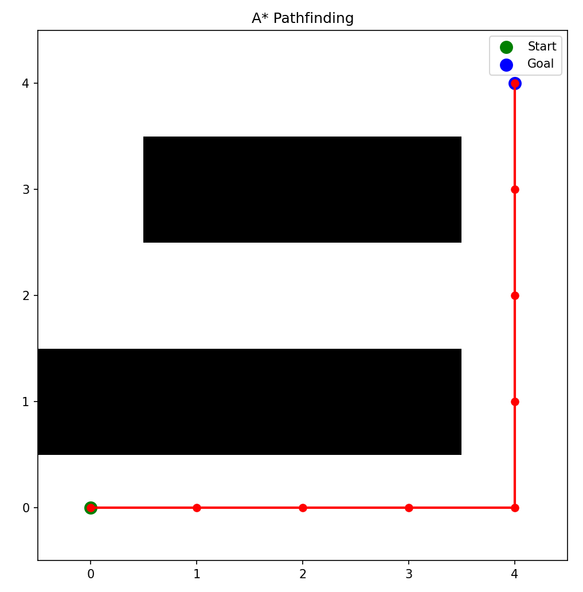

# 迪杰斯特拉算法原理及Python实现

---

## 算法简介

A\*算法是一种用于求解**最短路径**问题的启发式搜索算法，广泛应用于机器人路径规划、游戏地图寻路等场景。与 Dijkstra 算法不同，A\* 算法结合了实际路径代价和启发式估计，从而能更高效地找到从起点到终点的最优路径。

---

## 算法原理

A*算法基于以下评价函数进行节点选择：

```
f(n) = g(n) + h(n)
```

- `g(n)`：从起点到当前节点 n 的实际路径代价
- `h(n)`：从当前节点 n 到目标节点的启发式估计（通常使用曼哈顿距离）
- `f(n)`：总代价函数，表示当前路径的优劣程度

通过优先扩展 `f(n)` 最小的节点，A*算法在保证最优性的同时提高了搜索效率。

###### **曼哈顿距离**

A*算法中常用的启发函数之一是**曼哈顿距离（Manhattan Distance）**，适用于只能沿网格**上下左右**移动的情况。

它的计算方式为：

```
复制编辑
h(n) = |x₁ - x₂| + |y₁ - y₂|
```

其中 `(x₁, y₁)` 是当前节点的坐标，`(x₂, y₂)` 是目标节点的坐标。

这种距离计算方式类似在城市街区中沿街道走路，不能穿墙或斜着走，故称为“曼哈顿”——得名于纽约曼哈顿的棋盘格街道布局。

---

## 算法流程

### 步骤1：初始化

初始化三个核心数组：

- `g数组`：记录从起点到当前节点的最小代价，初始全部为 ∞，起点为 0
- `h数组`：记录当前节点到目标节点的启发式估值
- `f数组`：记录总代价，`f = g + h`
- `open_list`：优先队列（小顶堆），用于选择当前代价最小的节点
- `closed_list`：已访问节点集合，避免重复扩展
- `parent字典`：记录每个节点的前驱节点

### 步骤2：选择f值最小的节点

从 `open_list` 中取出 `f(n)` 最小的节点，作为当前处理节点。

### 步骤3：判断是否到达目标节点

若当前节点为目标节点，则说明路径已找到，调用 `seek_path` 方法回溯路径。

### 步骤4：扩展邻居节点

- 获取四个方向的可通行邻居节点（上下左右）
- 对每个邻居，计算新的 `g`、`h`、`f` 值
- 若该路径更优，则更新邻居节点的代价信息并加入 `open_list`

---

## Python实现

```python
import heapq
import matplotlib.pyplot as plt
import numpy as np

class AStar:
    def __init__(self, grid, start, goal):
        self.grid = grid
        self.start = start
        self.goal = goal
        self.rows = len(grid)
        self.cols = len(grid[0])
        self.open_list = []
        self.closed_list = set()
        self.f = np.full((self.rows, self.cols), np.inf)
        self.g = np.full((self.rows, self.cols), np.inf)
        self.h = np.full((self.rows, self.cols), 0)
        self.parent = {}

    def seek_heuristic(self, x, y):
        return abs(self.goal[0] - x) + abs(self.goal[1] - y)

    def seek_neighborhood(self, x, y):
        directions = [(0, 1), (0, -1), (1, 0), (-1, 0)]
        neighbors = []
        for dx, dy in directions:
            if 0 <= x + dx < self.rows and 0 <= y + dy < self.cols and self.grid[x + dx][y + dy] == 0:
                neighbors.append((x + dx, y + dy))
        return neighbors

    def run(self):
        self.g[self.start[0], self.start[1]] = 0
        self.h[self.start[0], self.start[1]] = self.seek_heuristic(*self.start)
        self.f[self.start[0], self.start[1]] = self.g[self.start[0], self.start[1]] + self.h[self.start[0], self.start[1]]
        heapq.heappush(self.open_list, (self.f[self.start[0], self.start[1]], self.start))

        while self.open_list:
            _, current_node = heapq.heappop(self.open_list)
            if current_node == self.goal:
                return self.seek_path()
            self.closed_list.add(current_node)

            for neighbor in self.seek_neighborhood(*current_node):
                if neighbor in self.closed_list:
                    continue
                current_g = self.g[current_node[0], current_node[1]] + 1
                if neighbor not in self.parent or current_g < self.g[neighbor[0], neighbor[1]]:
                    self.parent[neighbor] = current_node
                    self.g[neighbor[0], neighbor[1]] = current_g
                    self.h[neighbor[0], neighbor[1]] = self.seek_heuristic(*neighbor)
                    self.f[neighbor[0], neighbor[1]] = self.g[neighbor[0], neighbor[1]] + self.h[neighbor[0], neighbor[1]]
                    if neighbor not in [node[1] for node in self.open_list]:
                        heapq.heappush(self.open_list, (self.f[neighbor[0], neighbor[1]], neighbor))
        return None

    def seek_path(self):
        path = []
        current_node = self.goal
        while current_node != self.start:
            path.append(current_node)
            current_node = self.parent[current_node]
        path.append(self.start)
        path.reverse()
        return path
```

---

## 可视化路径

```python
def plot_path(grid, path):
    plt.figure(figsize=(8, 8))
    plt.imshow(grid, cmap='Greys', origin='lower')
    path_x, path_y = zip(*path)
    plt.plot(path_y, path_x, color='r', linewidth=2, marker='o')
    plt.scatter(path_y[0], path_x[0], color='g', s=100, label='Start')
    plt.scatter(path_y[-1], path_x[-1], color='b', s=100, label='Goal')
    plt.legend()
    plt.title("A* Pathfinding")
    plt.show()
```

---

## 代码测试

主程序测试代码为：

```python
if __name__ == "__main__":
    grid = [
        [0, 0, 0, 0, 0],
        [1, 1, 1, 1, 0],
        [0, 0, 0, 0, 0],
        [0, 1, 1, 1, 0],
        [0, 0, 0, 0, 0]
    ]
    start = (0, 0)
    goal = (4, 4)

    astar = AStar(grid, start, goal)
    path = astar.run()
    if path:
        print("路径为：", path)
        plot_path(grid, path)
    else:
        print("未找到路径")
```

运行结果为：

```css
路径为： [(0, 0), (0, 1), (0, 2), (0, 3), (0, 4), (1, 4), (2, 4), (2, 3), (2, 2), (2, 1), (2, 0), (3, 0), (4, 0), (4, 1), (4, 2), (4, 3), (4, 4)]
```



## 完整代码

```python
import heapq
import matplotlib.pyplot as plt
import numpy as np

class AStar:
    def __init__(self, grid, start, goal):
        self.grid=grid
        self.start=start
        self.goal=goal
        self.rows=len(grid)
        self.cols=len(grid[0])
        self.open_list=[]
        self.closed_list=set()
        self.f=np.full((self.rows,self.cols),np.inf)
        self.g=np.full((self.rows,self.cols),np.inf)
        self.h=np.full((self.rows,self.cols),0)
        self.parent={}

    def seek_heuristic(self,x,y):
        return abs(self.goal[0]-x)+abs(self.goal[1]-y)

    def seek_neighborhood(self,x,y):
        directions=[(0,1),(0,-1),(1,0),(-1,0)]
        neighbors=[]
        for dx,dy in directions:
            if 0<=x+dx<self.rows and 0<=y+dy<self.cols and self.grid[x+dx][y+dy]==0:
                neighbors.append((x+dx,y+dy))
        return neighbors

    def run(self):
        # 初始化起点
        self.g[self.start[0], self.start[1]] = 0
        self.h[self.start[0], self.start[1]] = self.seek_heuristic(self.start[0], self.start[1])
        self.f[self.start[0], self.start[1]] = self.g[self.start[0], self.start[1]]+self.h[self.start[0], self.start[1]]
        heapq.heappush(self.open_list,(self.f[self.start[0], self.start[1]],self.start))

        while self.open_list:
            _,current_node=heapq.heappop(self.open_list)
            if current_node==self.goal:
                return self.seek_path()

            self.closed_list.add(current_node)

            for neighbor in self.seek_neighborhood(current_node[0],current_node[1]):
                if neighbor in self.closed_list:
                    continue
                current_g=self.g[current_node[0],current_node[1]] + 1
                if neighbor not in self.parent or current_g<self.g[neighbor[0],neighbor[1]]:
                    self.parent[neighbor]=current_node
                    self.g[neighbor[0],neighbor[1]] = current_g
                    self.h[neighbor[0],neighbor[1]] = self.seek_heuristic(neighbor[0],neighbor[1])
                    self.f[neighbor[0],neighbor[1]] = self.g[neighbor[0],neighbor[1]] + self.h[neighbor[0],neighbor[1]]
                    if neighbor not in [node[1] for node in self.open_list]:
                        heapq.heappush(self.open_list,(self.f[neighbor[0],neighbor[1]],neighbor))
        return None

    def seek_path(self):
        path=[]
        current_node=self.goal
        while current_node!=self.start:
            path.append(current_node)
            current_node=self.parent[current_node]
        path.append(self.start)
        path.reverse()
        return path

def plot_path(grid,path):
    plt.figure(figsize=(8, 8))
    plt.imshow(grid, cmap='Greys', origin='lower')
    path_x, path_y = zip(*path)
    plt.plot(path_y, path_x, color='r', linewidth=2, marker='o')
    plt.scatter(path_y[0], path_x[0], color='g', s=100, label='Start')
    plt.scatter(path_y[-1], path_x[-1], color='b', s=100, label='Goal')
    plt.legend()
    plt.title("A* Pathfinding")
    plt.show()

# 测试
if __name__ == "__main__":
    grid = [
        [0, 0, 0, 0, 0],
        [1, 1, 1, 1, 0],
        [0, 0, 0, 0, 0],
        [0, 1, 1, 1, 0],
        [0, 0, 0, 0, 0]
    ]
    start = (0, 0)
    goal = (4, 4)

    astar = AStar(grid, start, goal)
    path = astar.run()
    if path:
        print("Path found:", path)
        plot_path(grid, path)
    else:
        print("No path found")
```

