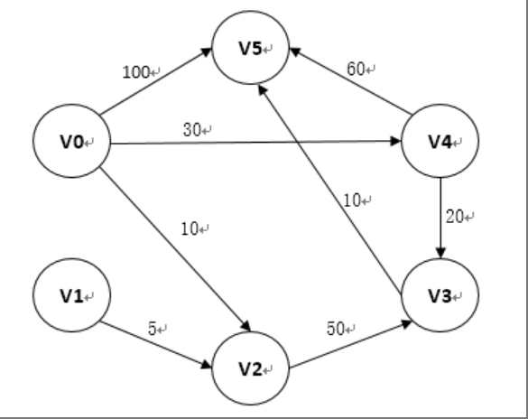
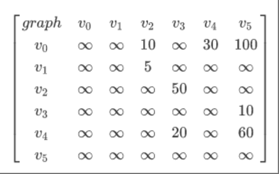

# 迪杰斯特拉算法原理及Python实现

---

## 算法简介

迪杰斯特拉（Dijkstra）算法主要用于求解**没有负值**的有向图的**单源最短路径**问题。

---

## 算法原理

算法基于贪心策略，其核心思想是通过逐步扩展已知最短路径的集合来找到从起点到所有其他节点的最短路径。

---

## 算法流程

### 步骤1：初始化

初始化cost数组，path数组和visited数组

#### cost数组

对于cost数组，初始全部设置为最大值，起点节点设置为0

```
cost数组：cost[i]表示从start_index到i号元素的最小花费
```

#### path数组

对于path数组，初始全部设置为-1，表示不可达，起点节点设置为起点节点的位置

```
path数组：path[i]表示从start_index到i号元素的最短路径中，到达i号元素的前一个元素索引为path[i]（即想要以最小花费到达i号元素，需要通过path[i]号元素）
```

#### visited数组

对于visited数组，初始全部设置为0，起点节点设置为1

```
visited数组：visited[i]表示i号元素是否被访问过（visited[i]==1表示已经找到了最优路径）
```

### 步骤2：找到下一个“最优节点”

“最优节点”指的是从当前节点到其他节点中代价最小的节点，这个“最优节点”也会作为下一次迭代的“当前节点”

### 步骤3：更新visited数组

将找到的最优节点设置成“已访问”状态，即将其设置为“当前节点”

### 步骤4：更新“最优节点附近节点的数据”

访问所有还未被访问的节点，若从当前节点“到此节点的代价更小，则更新cost数组和path数组

---

## Python实现





```python
def dijkstra(graph,start_index,max):
    # 初始化cost,path,visited数组

    # cost数组：cost[i]表示从start_index到i号元素的最小花费
    cost=[max]*len(graph)
    cost[start_index] = 0

    # path数组：path[i]表示从start_index到i号元素的最短路径中，到达i号元素的前一个元素索引为path[i]（即想要以最小花费到达i号元素，需要通过path[i]号元素）
    path = [-1] * len(graph)
    path[start_index] = start_index

    # visited数组：visited[i]表示i号元素是否被访问过（已经找到了最优路径）
    visited=[0]*len(graph)
    visited[start_index]=1

    for i in range(len(graph)):
        if(visited[i]==0):
            cost[i]=graph[start_index][i]
            # path[i]=-1表示不可达
            path[i]=(start_index if(cost[i]<max) else -1)

    # 主体代码
    for i in range(1,len(graph)):
        cur_index=-1
        min_cost=max
        # 找到下一步代价最小的节点
        for j in range(len(graph)):
            if(visited[j]==0):
                if(cost[j]<min_cost):
                    min_cost=cost[j]
                    cur_index=j

        # 如果没有找到可访问的节点，退出循环
        if cur_index==-1:
            break

        # 标记下一步代价最小的节点为已访问的节点（当前节点）
        visited[cur_index]=1

        # 依据找到的下一步代价最小的节点cur_index更新其附近一圈的节点数据
        for k in range(len(graph)):
            if(visited[k]==0):
                if(cost[cur_index]+graph[cur_index][k]<cost[k]):
                    cost[k]=cost[cur_index]+graph[cur_index][k]
                    path[k]=cur_index
    return path
```

---

## 输入与输出

输入为图的邻接矩阵，其中 `graph[i][j]` 表示从节点 `i` 到节点 `j` 的边的权重。如果节点之间没有直接的边，则用一个足够大的值（如 `max`）表示不可达。

输出为 `path` 数组，其中 `path[i]` 表示从起点到节点 `i` 的最短路径中，到达节点 `i` 的前一个节点的索引。如果节点不可达，则 `path[i]` 为 `-1`

若想通过path数组得到从起点到某个节点k的路径，可由如下代码实现：

```python
def get_path(path, start_index, target_index):
    if path[target_index] == -1:
        return "没有路径可达"
    path_list = []
    while target_index != start_index:
        path_list.append(target_index)
        target_index = path[target_index]
    path_list.append(start_index)
    path_list.reverse()
    return path_list
```

---

## 代码测试

主程序测试代码为：

```python
if __name__=="__main__":
    max=2**31-1
    graph=[
        [max, max, 10, max, 30, 100],
        [max, max, 5, max, max, max],
        [max, max, max, 50, max, max],
        [max, max, max, max, max, 10],
        [max, max, max, 20, max, 60],
        [max, max, max, max, max, max],
    ]
    result=dijkstra(graph,0,max)
    print("最短路径的前驱节点数组为：",result)
    target_index = 5
    path_to_target = get_path(result, 0, target_index)
    print(f"从起点到目标节点 {target_index} 的路径为：", path_to_target)
```

运行结果为：

```
E:\BLOG_article\Dijkstra\.venv\Scripts\python.exe E:\BLOG_article\Dijkstra\Dijkstra.py 
最短路径的前驱节点数组为： [0, -1, 0, 4, 0, 3]
从起点到目标节点 5 的路径为： [0, 4, 3, 5]
```

## 完整代码

```python
def dijkstra(graph,start_index,max):
    # 初始化cost,path,visited数组

    # cost数组：cost[i]表示从start_index到i号元素的最小花费
    cost=[max]*len(graph)
    cost[start_index] = 0

    # path数组：path[i]表示从start_index到i号元素的最短路径中，到达i号元素的前一个元素索引为path[i]（即想要以最小花费到达i号元素，需要通过path[i]号元素）
    path = [-1] * len(graph)
    path[start_index] = start_index

    # visited数组：visited[i]表示i号元素是否被访问过（已经找到了最优路径）
    visited=[0]*len(graph)
    visited[start_index]=1

    for i in range(len(graph)):
        if(visited[i]==0):
            cost[i]=graph[start_index][i]
            # path[i]=-1表示不可达
            path[i]=(start_index if(cost[i]<max) else -1)

    # 主体代码
    for i in range(1,len(graph)):
        cur_index=-1
        min_cost=max
        # 找到下一步代价最小的节点
        for j in range(len(graph)):
            if(visited[j]==0):
                if(cost[j]<min_cost):
                    min_cost=cost[j]
                    cur_index=j

        # 如果没有找到可访问的节点，退出循环
        if cur_index==-1:
            break

        # 标记下一步代价最小的节点为已访问的节点
        visited[cur_index]=1

        # 依据找到的下一步代价最小的节点cur_index更新其附近一圈的节点数据
        for k in range(len(graph)):
            if(visited[k]==0):
                if(cost[cur_index]+graph[cur_index][k]<cost[k]):
                    cost[k]=cost[cur_index]+graph[cur_index][k]
                    path[k]=cur_index
    return path

def get_path(path, start_index, target_index):
    if path[target_index] == -1:
        return "No path exists"
    path_list = []
    while target_index != start_index:
        path_list.append(target_index)
        target_index = path[target_index]
    path_list.append(start_index)
    path_list.reverse()
    return path_list

if __name__=="__main__":
    max=2**31-1
    graph=[
        [max, max, 10, max, 30, 100],
        [max, max, 5, max, max, max],
        [max, max, max, 50, max, max],
        [max, max, max, max, max, 10],
        [max, max, max, 20, max, 60],
        [max, max, max, max, max, max],
    ]
    result=dijkstra(graph,0,max)
    print("最短路径的前驱节点数组为：",result)
    target_index = 5
    path_to_target = get_path(result, 0, target_index)
    print(f"从起点到目标节点 {target_index} 的路径为：", path_to_target)
```

