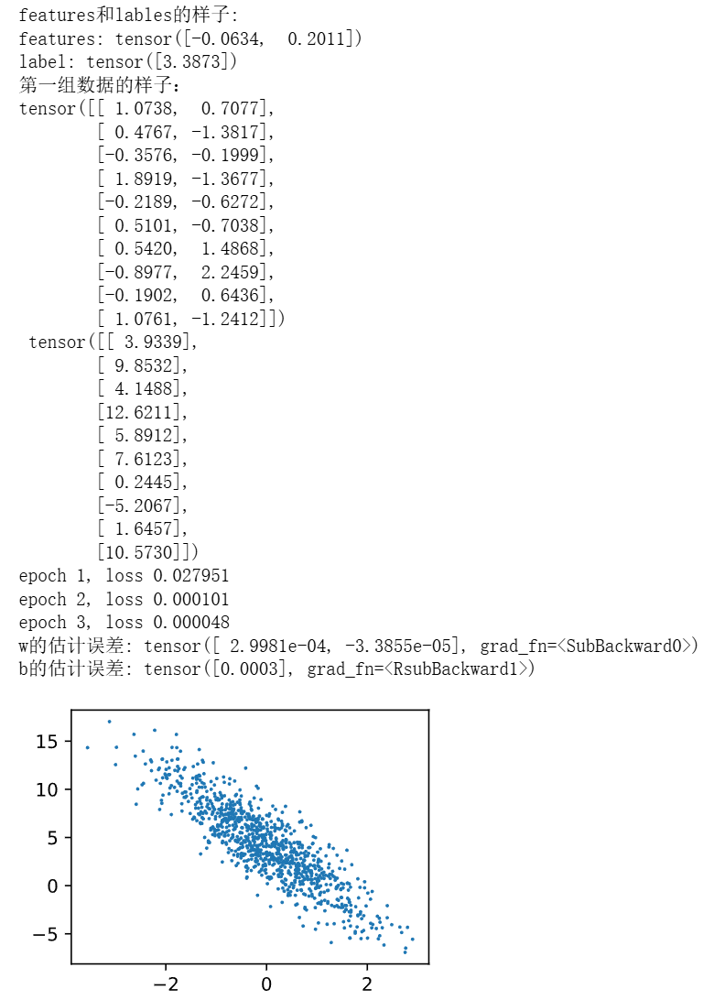

# 动手学深度学习-3.2. 线性回归的从零开始实现

---

## 代码

```python
%matplotlib inline
import random
import torch
from d2l import torch as d2l

# 生成X和带噪声的y
def synthetic_data(w, b, num_examples):  #@save
    """生成y=Xw+b+噪声"""
    #  生成x形状为[num_examples, len(w)]，本次为(1000，2)的服从标准正态分布的数据
    X = torch.normal(0, 1, (num_examples, len(w)))
    # matmul()实现矩阵和向量的乘法
    y = torch.matmul(X, w) + b
    y += torch.normal(0, 0.01, y.shape)
    # y.reshape((-1, 1))表示将y转换为一列形式的数据，-1代表自动根据别的维度调整，确保y为二维列向量，便于与模型输出做减法
    return X, y.reshape((-1, 1))

# 初始化w和b的真值
true_w = torch.tensor([2, -3.4]) 
true_b = 4.2

# features即为上述函数生成的X，形状为(1000,2)
# lables形状为(1000,1)
features, labels = synthetic_data(true_w, true_b, 1000)

# 查看features和labels的第一个值
print('features和labels的样子:')
print('features:', features[0],'\nlabel:', labels[0])

# 画出所有样本第2个特征与标签的散点图，观察特征和标签的线性关系
# features[:, (1)].detach().numpy()中：detach()表示从张量中分离出来数据（后续不参与反向传播），.numpy()表示matplotlib只能接受numpy数据
d2l.set_figsize()
d2l.plt.scatter(features[:, (1)].detach().numpy(), labels.detach().numpy(), 1);

# 分批次取出数据的函数
def data_iter(batch_size, features, labels):
    num_examples = len(features)
    indices = list(range(num_examples))
    # 这些样本是随机读取的，没有特定的顺序
    random.shuffle(indices)
    for i in range(0, num_examples, batch_size):
        batch_indices = torch.tensor(
            indices[i: min(i + batch_size, num_examples)])
        # yield 让函数变为生成器，每次返回一批数据，支持按需逐批读取所有样本，节省内存
        yield features[batch_indices], labels[batch_indices]
        
batch_size = 10

# 查看第一组数据的样子
for X, y in data_iter(batch_size, features, labels):
    print("第一组数据的样子：")
    print(X, '\n', y)
    break

# 初始化w和b为随机数
w = torch.normal(0, 0.01, size=(2,1), requires_grad=True)
b = torch.zeros(1, requires_grad=True)

def linreg(X, w, b):  #@save
    """线性回归模型"""
    return torch.matmul(X, w) + b

def squared_loss(y_hat, y):  #@save
    """均方损失"""
    return (y_hat - y.reshape(y_hat.shape)) ** 2 / 2

def sgd(params, lr, batch_size):  #@save
    """小批量随机梯度下降"""
    with torch.no_grad():
        for param in params:
            param -= lr * param.grad / batch_size
            # 每次手动梯度清零（因为每次param.grad属性是 PyTorch 张量的一个成员，专门用来存放当前参数的梯度值）
            # 每次调用 .backward()，PyTorch 会把算出来的梯度加到参数已有的 .grad 上，而不是覆盖
            # 如果不清零，每个 batch、每个 mini-batch 的梯度就会一直累加下去，最后更新参数时会把之前的全部加上，导致训练发散或完全错误。
            param.grad.zero_()

lr = 0.03
# 训练轮数
num_epochs = 3
# 选用线性模型（上面自己写好的函数）
net = linreg
# 选用均方误差（上面自己写好的函数）
loss = squared_loss

for epoch in range(num_epochs):
    for X, y in data_iter(batch_size, features, labels):
        l = loss(net(X, w, b), y)  # X和y的小批量损失
        # 因为l形状是(batch_size,1)，而不是一个标量。l中的所有元素被加到一起，并以此计算关于[w,b]的梯度（因为backward要求标量作为目标）
        # 同时也对应了sgd()函数中的：param -= lr * param.grad / batch_size的“/ batch_size”，即先求和再除以批大小
        # 完全也可以sgd()函数不除以batch_size，然后此处sum()改为mean()
        l.sum().backward()
        sgd([w, b], lr, batch_size)  # 使用参数的梯度更新参数
    with torch.no_grad():
        train_l = loss(net(features, w, b), labels)
        print(f'epoch {epoch + 1}, loss {float(train_l.mean()):f}')
    
print(f'w的估计误差: {true_w - w.reshape(true_w.shape)}')
print(f'b的估计误差: {true_b - b}')
```

---

## 运行结果


