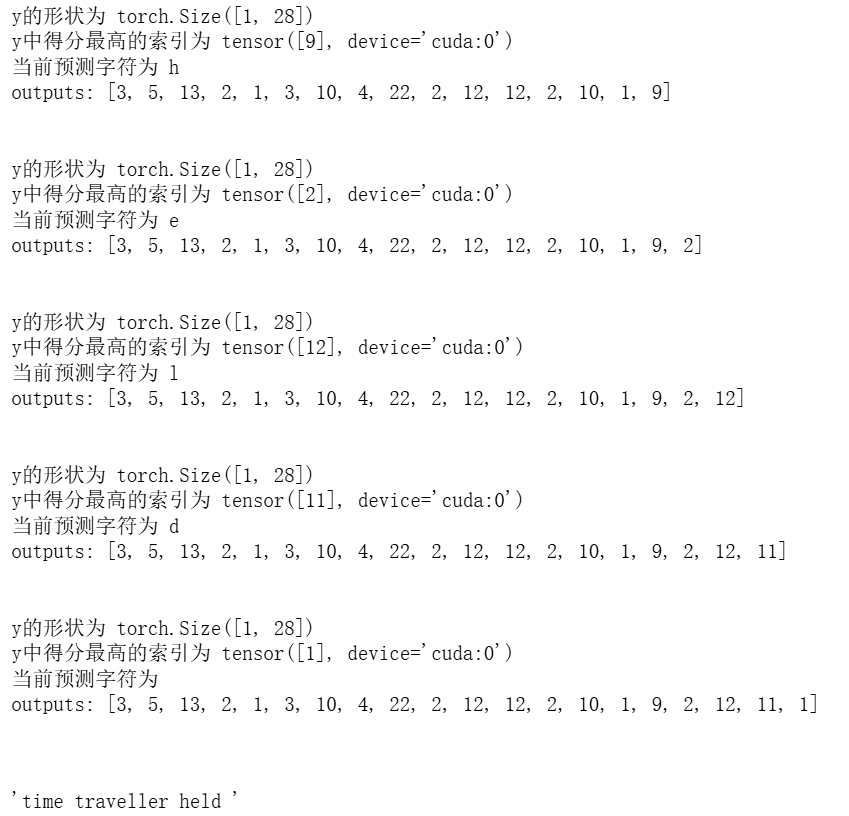
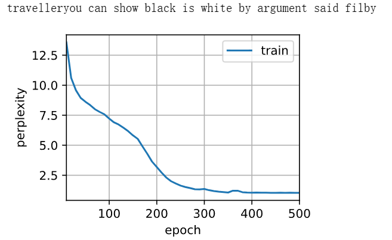
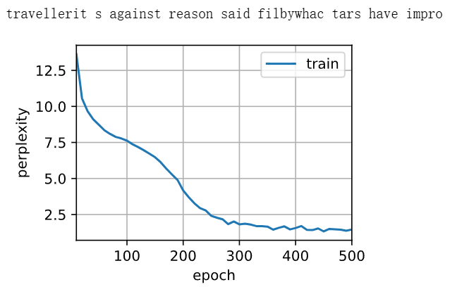

# 动手学深度学习-8.5. 循环神经网络的从零开始实现

---

## 代码

```python
import collections
import re
from d2l import torch as d2l
import random
```

```python
# d2l.DATA_HUB是一个字典，用于存储数据集的下载地址和文件校验信息（哈希值）
# key：数据集名称 'time_machine'
# value：一个 tuple (url, sha1)
d2l.DATA_HUB['time_machine'] = (d2l.DATA_URL + 'timemachine.txt',
                                '090b5e7e70c295757f55df93cb0a180b9691891a')

def read_time_machine():  #@save
    """将时间机器数据集加载到文本行的列表中"""
    with open(d2l.download('time_machine'), 'r') as f:
        lines = f.readlines()
    # '[^A-Za-z]+' 匹配 所有连续的非字母字符（空格、标点、数字等），并将其替换为空格
    # .strip()删除字符串开头和结尾的空格
    return [re.sub('[^A-Za-z]+', ' ', line).strip().lower() for line in lines]

# 把文本行拆分成词元（tokens），可以按单词或者按字符拆分
# lines为存储文本行的列表
def tokenize(lines, token='word'):  #@save
    """将文本行拆分为单词或字符词元"""
    if token == 'word':
        # 注意line.split()本身是一个列表，这个分支情况的返回值形如：[['the', 'time', 'machine'], ['by', 'h', 'g', 'wells']]
        return [line.split() for line in lines]
    elif token == 'char':
        return [list(line) for line in lines]
    else:
        print('错误：未知词元类型：' + token)
        
def count_corpus(tokens):  #@save
    """统计词元的频率"""
    # 这里的tokens是1D列表或2D列表
    if len(tokens) == 0 or isinstance(tokens[0], list):
        # 将词元列表展平成一个列表（列表的嵌套表达式）
        # 外层：for line in tokens → 遍历 tokens 中的每一行（每一行本身是一个列表）
        # 内层：for token in line → 遍历这一行中的每个元素（词元）
        tokens = [token for line in tokens for token in line]
    # 返回的是一个字典，键是元素，值是出现次数。
    return collections.Counter(tokens)

# 词表类
class Vocab:  
    """文本词表"""
    def __init__(self, tokens=None, min_freq=0, reserved_tokens=None):
        if tokens is None:
            tokens = []
        # reserved_tokens：保留的特殊词元列表
        if reserved_tokens is None:
            reserved_tokens = []
        # 按出现频率排序
        counter = count_corpus(tokens)
        # counter.items() 返回字典的 键值对列表，每个元素是 (key, value) 元组
        # key=lambda x: x[1]表示按照value的值大小排序
        self._token_freqs = sorted(counter.items(), key=lambda x: x[1],
                                   reverse=True)
        # 生成一个列表，未知词元的索引为0
        self.idx_to_token = ['<unk>'] + reserved_tokens
        # 生成一个字典，enumerate(self.idx_to_token) 会生成 (索引, 词元) 对
        self.token_to_idx = {token: idx
                             for idx, token in enumerate(self.idx_to_token)}
        for token, freq in self._token_freqs:
            if freq < min_freq:
                break
            if token not in self.token_to_idx:
                self.idx_to_token.append(token)
                self.token_to_idx[token] = len(self.idx_to_token) - 1

    def __len__(self):
        return len(self.idx_to_token)
    
    # 把一个词（或词列表）转换成它在词表中的索引
    def __getitem__(self, tokens):
        # 如果tokens不是列表或元组
        if not isinstance(tokens, (list, tuple)):
            # Python 字典 get 方法的标准用法，它接受 两个参数：dict.get(key, default)
            # 第一个参数 key：要查找的键，这里是 tokens（单个词）。
            # 第二个参数 default：如果字典里没有这个键时返回的值，这里是 self.unk（未知词的索引，通常是 0）。
            return self.token_to_idx.get(tokens, self.unk)
        return [self.__getitem__(token) for token in tokens]
    
    # 把索引（或索引列表）转换回词
    def to_tokens(self, indices):
        if not isinstance(indices, (list, tuple)):
            return self.idx_to_token[indices]
        return [self.idx_to_token[index] for index in indices]
    
    # @property 是 Python 的一个 装饰器（decorator），用于把一个类的方法 变成属性（attribute） 来访问，而不需要加括号()调用
    @property
    def unk(self):  # 未知词元的索引为0
        return 0

    @property
    def token_freqs(self):
        return self._token_freqs
    
# 返回时光机器数据集的词元索引列表和词表
def load_corpus_time_machine(max_tokens=-1): 
    lines = read_time_machine()
    # 将每行文本拆成字符列表（因为 'char'），tokens 是一个二维列表
    tokens = tokenize(lines, 'char')
    vocab = Vocab(tokens)
    # 因为时光机器数据集中的每个文本行不一定是一个句子或一个段落，
    # 所以将所有文本行展平到一个列表中
    # 当写 vocab[token] 时，Python 会自动调用 vocab.__getitem__(token)，返回对应的索引
    # corpus是一个列表，按照原本文本的字符顺序，把各个字符在词表中对应的索引保存起来
    corpus = [vocab[token] for line in tokens for token in line]
    if max_tokens > 0:
        corpus = corpus[:max_tokens]
    return corpus, vocab

# 使用随机抽样生成一个小批量子序列
# batch_size：每个小批量包含多少条子序列
# num_steps: 每个子序列的长度（即时间步数）
def seq_data_iter_random(corpus, batch_size, num_steps):
    # 从随机偏移量开始对序列进行分区，随机范围包括num_steps-1
    corpus = corpus[random.randint(0, num_steps - 1):]
    
    # num_subseqs表示可以切出多少个长度为 num_steps 的子序列
    # 减去1，因为要给标签留一个位置
    num_subseqs = (len(corpus) - 1) // num_steps
    
    # 构造所有子序列的起始索引，每隔 num_steps 取一个
    initial_indices = list(range(0, num_subseqs * num_steps, num_steps))
    
    # 在随机抽样的迭代过程中，来自两个相邻的、随机的、小批量中的子序列不一定在原始序列上相邻
    random.shuffle(initial_indices)

    def data(pos):
        # 返回从pos位置开始的长度为num_steps的序列
        return corpus[pos: pos + num_steps]
    
    # num_batches表示能完整分多少个 batch
    num_batches = num_subseqs // batch_size
    for i in range(0, batch_size * num_batches, batch_size):
        # 在这里，initial_indices包含子序列的随机起始索引
        initial_indices_per_batch = initial_indices[i: i + batch_size]
        X = [data(j) for j in initial_indices_per_batch]
        Y = [data(j + 1) for j in initial_indices_per_batch]
        yield torch.tensor(X), torch.tensor(Y)
# 举例：假设corpus = list(range(30)),就是[0,1,2,...,29],batch_size = 2,num_steps = 5
# num_subseqs = (30-1)//5 = 5,所以一共可以切 5 段子序列，每段长 5：
    # [0,1,2,3,4]
    # [5,6,7,8,9]
    # [10,11,12,13,14]
    # [15,16,17,18,19]
    # [20,21,22,23,24]
# 得到 initial_indices = [0, 5, 10, 15, 20] ,打乱后：[15, 0, 20, 10, 5]
# num_batches = 5 // 2 = 2，所以总共能生成 2 个 batch。
# 循环展开：
    # i=0时：initial_indices_per_batch = [15, 0]，X = [data(15), data(0)]，Y = [data(16), data(1)]
        # 得到X = [[15,16,17,18,19],[0,1,2,3,4]]，Y = [[16,17,18,19,20],[1,2,3,4,5]]
    # i=2时：initial_indices_per_batch = [20, 10]，X = [data(20), data(10)]，Y = [data(21), data(11)]
        # 得到X = [[20,21,22,23,24],[10,11,12,13,14]]，Y = [[21,22,23,24,25],[11,12,13,14,15]]


# 使用顺序分区生成一个小批量子序列
def seq_data_iter_sequential(corpus, batch_size, num_steps):  #@save
    # 从随机偏移量开始划分序列
    offset = random.randint(0, num_steps)
    num_tokens = ((len(corpus) - offset - 1) // batch_size) * batch_size
    Xs = torch.tensor(corpus[offset: offset + num_tokens])
    Ys = torch.tensor(corpus[offset + 1: offset + 1 + num_tokens])
    Xs, Ys = Xs.reshape(batch_size, -1), Ys.reshape(batch_size, -1)
    num_batches = Xs.shape[1] // num_steps
    for i in range(0, num_steps * num_batches, num_steps):
        X = Xs[:, i: i + num_steps]
        Y = Ys[:, i: i + num_steps]
        yield X, Y
        
class SeqDataLoader:  #@save
    """加载序列数据的迭代器"""
    def __init__(self, batch_size, num_steps, use_random_iter, max_tokens):
        if use_random_iter:
            self.data_iter_fn = seq_data_iter_random
        else:
            self.data_iter_fn = seq_data_iter_sequential
        self.corpus, self.vocab = load_corpus_time_machine(max_tokens)
        self.batch_size, self.num_steps = batch_size, num_steps
    
    # 当写 for X, Y in train_iter: 时，Python 会自动调用 train_iter.__iter__()
    def __iter__(self):
        return self.data_iter_fn(self.corpus, self.batch_size, self.num_steps)

def load_data_time_machine(batch_size, num_steps,
                           use_random_iter=False, max_tokens=10000):
    """返回时光机器数据集的迭代器和词表"""
    data_iter = SeqDataLoader(
        batch_size, num_steps, use_random_iter, max_tokens)
    return data_iter, data_iter.vocab
```
```python
%matplotlib inline
import math
import torch
from torch import nn
from torch.nn import functional as F
```

```python
batch_size, num_steps = 32, 35
train_iter, vocab = load_data_time_machine(batch_size, num_steps)
```

```python
F.one_hot(torch.tensor([0, 2]), len(vocab))
```

```python
# 利用jupyter notebook测试上述代码
vocab['a'] # 返回4
vocab.token_to_idx['a']==vocab['a'] # 返回True
vocab.idx_to_token[0] # 返回'<unk>'
vocab.idx_to_token[2] # 返回'e'

# 返回torch.Size([5, 2, 28])
X = torch.arange(10).reshape((2, 5))
F.one_hot(X.T, 28).shape
```

```python
def get_params(vocab_size, num_hiddens, device):
    # 词表长度为28，因为输入时需要将每一个token进行独热编码，则此处输入长度应该也为28 
    num_inputs = num_outputs = vocab_size
    
    def normal(shape):
        # randn 的意思就是 random normal，它会从标准正态分布中采样数据，乘0.01后服从标准差为0.01的高斯分布
        return torch.randn(size=shape, device=device) * 0.01
    
    # H_t = tanh( X_t·W_xh + H_t-1·W_hh + b_h )
    # 隐藏层参数
    W_xh = normal((num_inputs, num_hiddens))
    W_hh = normal((num_hiddens, num_hiddens))
    b_h = torch.zeros(num_hiddens, device=device)
    
    # O_t = H_t·W_hq + b_q
    # 输出层参数
    W_hq = normal((num_hiddens, num_outputs))
    b_q = torch.zeros(num_outputs, device=device)
    
    # 附加梯度
    params = [W_xh, W_hh, b_h, W_hq, b_q]
    for param in params:
        param.requires_grad_(True)
    return params
```

```python
#返回隐藏层初始状态，此处为全零
def init_rnn_state(batch_size, num_hiddens, device):
    return (torch.zeros((batch_size, num_hiddens), device=device), )
```

```python
# inputs形状为 (num_steps, batch_size, vocab_size)
# state形状为 (batch_size, num_hiddens)
def rnn(inputs, state, params):
    # inputs的形状：(时间步数量，批量大小，词表大小)
    W_xh, W_hh, b_h, W_hq, b_q = params
    H, = state
    outputs = []
    # X的形状：(batch_size, vocab_size)
    for X in inputs:
        # H_t = tanh( X_t·W_xh + H_t-1·W_hh + b_h )
        # (batch_size, num_hiddens) = (batch_size, vocab_size)*(vocab_size, num_hiddens) + (batch_size, num_hiddens)*(num_hiddens, num_hiddens) + (num_hiddens,)
        # 其中b_h形状(num_hiddens,)会被解释成(1, num_hiddens) → 自动广播成 (batch_size, num_hiddens)
        # 在默认的一维 bias 情况下，PyTorch 总是在最前面加一个维度 → (1, num_hiddens),而不会被解释成(num_hiddens,1)
        H = torch.tanh(torch.mm(X, W_xh)
                       + torch.mm(H, W_hh)
                       + b_h)
        
        # O_t = H_t·W_hq + b_q
        # (batch_size, vocab_size) = (batch_size, num_hiddens)*(num_hiddens, vocab_size) + (vocab_size,)
        # # 其中b_q形状(vocab_size,)会被解释成(1, vocab_size) → 自动广播成 (batch_size, vocab_size)
        Y = torch.mm(H, W_hq) + b_q
        outputs.append(Y)
    # 沿着第一个维度将outputs数组进行拼接
    # outputs本身为长度为num_steps的列表，outputs[i] 的形状就是 (batch_size, vocab_size)
    # 拼接后形状为(num_steps*batch_size, vocab_size)
    return torch.cat(outputs, dim=0), (H,)
```

```python
class RNNModelScratch:
    """从零开始实现的循环神经网络模型"""
    def __init__(self, vocab_size, num_hiddens, device, get_params, init_state, forward_fn):
        self.vocab_size, self.num_hiddens = vocab_size, num_hiddens
        self.params = get_params(vocab_size, num_hiddens, device)
        self.init_state, self.forward_fn = init_state, forward_fn
    # __call__ 函数在用类实例像函数一样调用时会自动执行
    def __call__(self, X, state):
        X = F.one_hot(X.T, self.vocab_size).type(torch.float32)
        return self.forward_fn(X, state, self.params)

    def begin_state(self, batch_size, device):
        return self.init_state(batch_size, self.num_hiddens, device)
```

```python
num_hiddens = 512
```

```python
# net是类的实例对象
net = RNNModelScratch(len(vocab), num_hiddens, d2l.try_gpu(), get_params,
                      init_rnn_state, rnn)
state = net.begin_state(X.shape[0], d2l.try_gpu())

# 实例对象被像函数一样调用时自动触发call函数，net(...)等价于net.__call__(...)
Y, new_state = net(X.to(d2l.try_gpu()), state)
Y.shape, len(new_state), new_state[0].shape
```

```python
# prefix 是函数的一个输入参数，表示生成文本的前缀字符串
def predict_ch8(prefix, num_preds, net, vocab, device):
    """在prefix后面生成新字符"""
    state = net.begin_state(batch_size=1, device=device)
    # 把 prefix 的第一个字符转换成对应的索引（通过词表 vocab）加入 outputs 列表
    outputs = [vocab[prefix[0]]]
    
    # 定义一个匿名函数，每次调用返回当前 RNN 的输入，outputs[-1] 是上一个生成的字符的索引
    get_input = lambda: torch.tensor([outputs[-1]], device=device).reshape((1, 1))
    
    # 预热期，让 RNN 根据前缀 prefix “热身”，更新隐藏状态
    for y in prefix[1:]:
        # _ 表示输出暂时不用，只更新隐藏状态，即state 会被更新，用于下一个时间步
        _, state = net(get_input(), state)
        # 同时把前缀中对应字符的索引追加到 outputs列表中
        outputs.append(vocab[y])
        
    # 预测num_preds步
    for _ in range(num_preds):
        y, state = net(get_input(), state)
        print("y的形状：",y.shape)
        print("y中得分最高的索引：",y.argmax(dim=1))
        print("当前预测字符：",vocab.idx_to_token[int(y.argmax(dim=1))])
        # 把预测出来的对应字符的索引追加到 outputs列表中
        # y.argmax(dim=1) 取得分最高的索引 → 当前预测字符
        outputs.append(int(y.argmax(dim=1).reshape(1)))
        print("outputs列表:",outputs)
        print("\n")
    return ''.join([vocab.idx_to_token[i] for i in outputs])
```

```python
predict_ch8('time traveller ', 10, net, vocab, d2l.try_gpu())
```

<div align=center>
    
<div>

```python
# 梯度裁剪，防止梯度爆炸
def grad_clipping(net, theta):
    # 如果 net 是 PyTorch 模块，直接用 net.parameters() 获取可训练参数
    if isinstance(net, nn.Module):
        params = [p for p in net.parameters() if p.requires_grad]
    else:
        params = net.params
    # 计算梯度范数（对所有参数的梯度求平方和，然后开平方）
    # 这一行的norm是一个标量，是params里所有参数（每一个参数是一个矩阵）的平方和在开方
    norm = torch.sqrt(sum(torch.sum((p.grad ** 2)) for p in params))
    if norm > theta:
        for param in params:
            # 修改过后的梯度向量的L2范数为theta
            param.grad[:] *= theta / norm
```

```python
# 训练一个 epoch
def train_epoch_ch8(net, train_iter, loss, updater, device, use_random_iter):
    state, timer = None, d2l.Timer()
    # 总损失 metric[0]，总词元数 metric[1]
    metric = d2l.Accumulator(2)
    
    # X形状为(batch_size, num_steps)，Y与X形状相同
    for X, Y in train_iter:
        # 第一次迭代，或者使用随机采样时，每个小批量都重新初始化隐藏状态
        if state is None or use_random_iter:
            state = net.begin_state(batch_size=X.shape[0], device=device)
        else:
            if isinstance(net, nn.Module) and not isinstance(state, tuple):
                # state对于nn.GRU是个张量
                state.detach_()
            else:
                # state对于nn.LSTM或对于我们从零开始实现的模型是个张量
                for s in state:
                    s.detach_()
        
        # 先将Y的形状转置为(num_steps, batch_size),再按行展平成一维向量，形状为(batch_size * num_steps,)
        # 为什么要先转置？ 因为希望按照时间步顺序展平而不是批量顺序
        # 展平后为（第1个时间步每个batch的第一个元素，然后第2个时间步每个batch的第二个元素，...）
        # 因为后续y_hat形状为(batch_size∗num_steps,vocab_size)
            # PyTorch 的 CrossEntropyLoss 要求：
            # input：形状 (N, C)，N 是样本数，C 是类别数。
            # target：形状 (N,)，一维整数向量表示每个样本的类别。
        y = Y.T.reshape(-1)
        X, y = X.to(device), y.to(device)
        y_hat, state = net(X, state)
        l = loss(y_hat, y.long()).mean()
        if isinstance(updater, torch.optim.Optimizer):
            updater.zero_grad()
            l.backward()
            grad_clipping(net, 1)
            updater.step()
        else:
            l.backward()
            grad_clipping(net, 1)
            # 因为已经调用了mean函数
            updater(batch_size=1)
        metric.add(l * y.numel(), y.numel())
    return math.exp(metric[0] / metric[1]), metric[1] / timer.stop()
```

```python
# 训练整个RNN模型
def train_ch8(net, train_iter, vocab, lr, num_epochs, device,
              use_random_iter=False):
    loss = nn.CrossEntropyLoss()
    animator = d2l.Animator(xlabel='epoch', ylabel='perplexity',
                            legend=['train'], xlim=[10, num_epochs])
    # 初始化
    if isinstance(net, nn.Module):
        updater = torch.optim.SGD(net.parameters(), lr)
    else:
        updater = lambda batch_size: d2l.sgd(net.params, lr, batch_size)
    predict = lambda prefix: predict_ch8(prefix, 50, net, vocab, device)
    # 训练和预测
    for epoch in range(num_epochs):
        ppl, speed = train_epoch_ch8(
            net, train_iter, loss, updater, device, use_random_iter)
        if (epoch + 1) % 10 == 0:
            print(predict('time traveller'))
            animator.add(epoch + 1, [ppl])
    print(f'困惑度 {ppl:.1f}, {speed:.1f} 词元/秒 {str(device)}')
    print(predict('time traveller'))
    print(predict('traveller'))
```

```python
# 顺序分区（sequential） 生成训练小批量
num_epochs, lr = 500, 1
train_ch8(net, train_iter, vocab, lr, num_epochs, d2l.try_gpu())
```

<div align=center>
    
<div>

```python
# 随机抽样（random）生成训练小批量
net = RNNModelScratch(len(vocab), num_hiddens, d2l.try_gpu(), get_params,
                      init_rnn_state, rnn)
train_ch8(net, train_iter, vocab, lr, num_epochs, d2l.try_gpu(),
          use_random_iter=True)
```

<div align=center>
    
<div>

