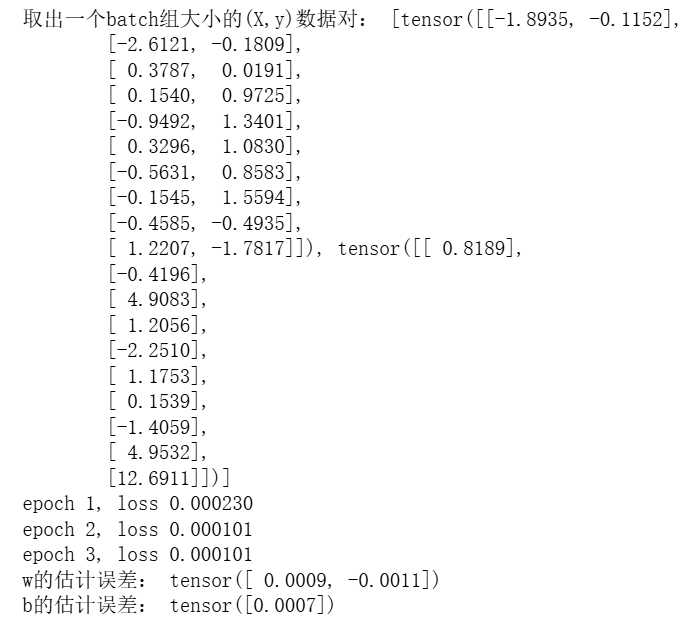

# 动手学深度学习-3.3. 线性回归的简洁实现

---

## 代码

```python
import numpy as np
import torch
from torch.utils import data
from d2l import torch as d2l

true_w = torch.tensor([2, -3.4])
true_b = 4.2
# 使用d2l包自带的功能生成符合y=wx+b的带噪声的数据X和y
features, labels = d2l.synthetic_data(true_w, true_b, 1000)

def load_array(data_arrays, batch_size, is_train=True):  #@save
    """构造一个PyTorch数据迭代器"""
    # TensorDataset 是一个数据集类型，将多个张量（tensor）打包成一个可索引的数据集
    # *data_arrays 的 * 是 Python 的“拆包”语法
    # 如果 data_arrays 是 (features, labels)，那么 *data_arrays 就会展开成两个参数：TensorDataset(features, labels)
    dataset = data.TensorDataset(*data_arrays)
    # DataLoader返回可迭代对象
    # 返回的 DataLoader 支持小批量、自动乱序（若 is_train=True）以及高效迭代
    return data.DataLoader(dataset, batch_size, shuffle=is_train)

batch_size = 10
data_iter = load_array((features, labels), batch_size)

# 打印的是一个batch的特征和标签，不是一对（是一组）
print("取出一个batch组大小的(X,y)数据对：",next(iter(data_iter)))

# nn是神经网络的缩写
from torch import nn

# nn 是 PyTorch 的神经网络模块
# nn.Linear(2, 1)表示全连接层，输入为2维，输出为1维
net = nn.Sequential(nn.Linear(2, 1))

# net[0]：相当于取 nn.Sequential 里的第一个层（这里就是 nn.Linear(2, 1)）
# .weight 表示第一层的权重张量，.data 直接访问权重数据本身（通常只在初始化或调试用）
net[0].weight.data.normal_(0, 0.01)
net[0].bias.data.fill_(0)

loss = nn.MSELoss()

trainer = torch.optim.SGD(net.parameters(), lr=0.03)

num_epochs = 3
for epoch in range(num_epochs):
    for X, y in data_iter:
        #  net(X)就是神经网络预测的结果
        l = loss(net(X) ,y)
        # zero_grad是清除累积梯度
        trainer.zero_grad()
        # l.backward是反向传播自动求导
        l.backward()
        # step是用梯度更新参数
        trainer.step()
    l = loss(net(features), labels)
    print(f'epoch {epoch + 1}, loss {l:f}')
    
w = net[0].weight.data
print('w的估计误差：', true_w - w.reshape(true_w.shape))
b = net[0].bias.data
print('b的估计误差：', true_b - b)
```

---

## 运行结果


