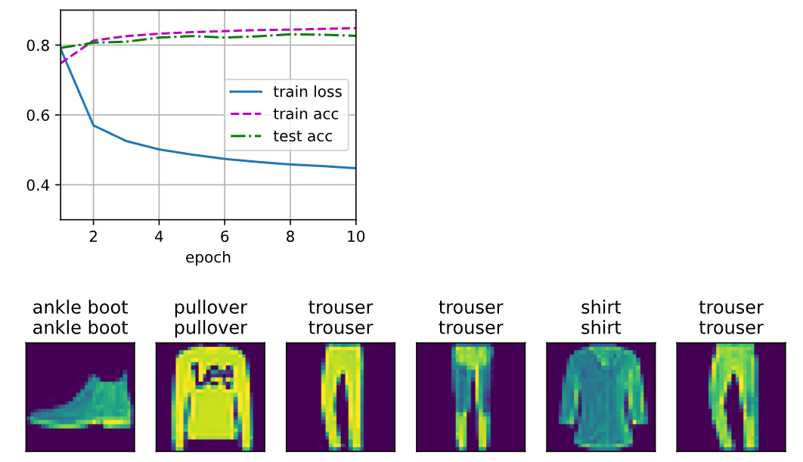

# 3.6. softmax回归的从零开始实现

---

## 代码

```python
import torch
from IPython import display
from d2l import torch as d2l
# 图像预处理流水线（load_data_fashion_mnist用到）
from torchvision import transforms
# 数据集加载（load_data_fashion_mnist用到FashionMNIST）
import torchvision
# DataLoader等数据批处理工具（load_data_fashion_mnist等用到）
from torch.utils import data           

# 选择数据加载线程数
def get_dataloader_workers():
    """使用多少个进程来读取数据。win建议1，linux建议4"""
    return 4

# 数据加载与预处理
def load_data_fashion_mnist(batch_size, resize=None):  #@save
    
    # 1. 创建处理操作列表（先转张量，必要时resize插在前面）
    # trans是一个长度为1的列表，只有ToTensor()操作的这一个元素
    trans = [transforms.ToTensor()]
    # 如果有resize操作，将其插入trans列表中的首位
    if resize:
        trans.insert(0, transforms.Resize(resize))
        
    # 2. 组装成复合变换器
    trans = transforms.Compose(trans)    

    # 3. 加载训练集和测试集（图片将自动做上述预处理）
    mnist_train = torchvision.datasets.FashionMNIST(
        root="../data", train=True, transform=trans, download=True)
    mnist_test = torchvision.datasets.FashionMNIST(
        root="../data", train=False, transform=trans, download=True)

    # 4. 用DataLoader分批加载（训练集打乱，测试集不打乱）
    return (data.DataLoader(mnist_train, batch_size, shuffle=True,
                            num_workers=get_dataloader_workers()),
            data.DataLoader(mnist_test, batch_size, shuffle=False,
                            num_workers=get_dataloader_workers()))

# 获取训练、测试集数据批量迭代器
batch_size = 256
train_iter, test_iter = load_data_fashion_mnist(batch_size)

# 参数初始化
# 28*28像素=784，输入特征长度
num_inputs = 784
# 10类（每个图片属于0~9之一）
num_outputs = 10

# 权重参数（正态分布初始化），形状[784,10]
W = torch.normal(0, 0.01, size=(num_inputs, num_outputs), requires_grad=True)
b = torch.zeros(num_outputs, requires_grad=True)   # 偏置参数

# Softmax函数
def softmax(X):
    X_exp = torch.exp(X)                         # 对每个元素做指数运算
    partition = X_exp.sum(1, keepdim=True)       # 每行求和得到分母（列向量），保留二维结构
    return X_exp / partition                     # 用广播机制，每个元素除以对应分母，得到概率

# 线性分类器（前向传播）
def net(X):
    # 1. X展平成二维(batch,784)；2. 乘以权重再加偏置；3. 送入softmax得到概率
    return softmax(torch.matmul(X.reshape((-1, W.shape[0])), W) + b)

# 交叉熵损失函数
def cross_entropy(y_hat, y):
    # 取每个样本真实类别的概率，取对数后取负，得到损失
    return - torch.log(y_hat[range(len(y_hat)), y])

# 计算准确率的函数
def accuracy(y_hat, y):  #@save
    """计算预测正确的数量"""
    # 如果y_hat是概率分布，先转成预测类别（取最大概率的下标）
    if len(y_hat.shape) > 1 and y_hat.shape[1] > 1:
        y_hat = y_hat.argmax(axis=1)
    # 比较预测类别和真实标签，得到布尔型（True/False）
    cmp = y_hat.type(y.dtype) == y
    return float(cmp.type(y.dtype).sum())    # 统计预测正确个数

# 在完整数据集上评估准确率
def evaluate_accuracy(net, data_iter): 
    """计算在指定数据集上模型的精度"""
    if isinstance(net, torch.nn.Module):
        net.eval()                      # 如果是标准PyTorch模型，切换到评估模式
    metric = Accumulator(2)             # [预测对数，总样本数]
    with torch.no_grad():               # 禁用梯度，节省内存和计算
        for X, y in data_iter:
            metric.add(accuracy(net(X), y), y.numel())
    return metric[0] / metric[1]        # 返回准确率

# 多变量累加器工具类
class Accumulator:  #@save
    """在n个变量上累加"""
    def __init__(self, n):
        self.data = [0.0] * n   # 初始化长度为n的列表
    def add(self, *args):
        self.data = [a + float(b) for a, b in zip(self.data, args)] # 位置对齐相加
    def reset(self):
        self.data = [0.0] * len(self.data)
    # __getitem__是python内置的魔法方法
    def __getitem__(self, idx):
        return self.data[idx]    # 支持索引读取（obj[idx]）

# 示例：评估当前网络在测试集上的准确率
evaluate_accuracy(net, test_iter)

# 训练一轮epoch
def train_epoch_ch3(net, train_iter, loss, updater):  #@save
    """训练模型一个迭代周期"""
    if isinstance(net, torch.nn.Module):
        net.train()           # 如果是标准模型，切换到训练模式
    metric = Accumulator(3)   # [损失和，预测对数，样本总数]
    for X, y in train_iter:
        # 前向传播，计算预测和损失
        y_hat = net(X)
        l = loss(y_hat, y)
        # 反向传播与参数更新（两种情况）
        if isinstance(updater, torch.optim.Optimizer):
            updater.zero_grad()
            l.mean().backward()
            updater.step()
        else:
            l.sum().backward()
            updater(X.shape[0])
        # 累加统计量
        metric.add(float(l.sum()), accuracy(y_hat, y), y.numel())
    # 返回平均损失和准确率
    return metric[0] / metric[2], metric[1] / metric[2]

# 训练过程动画可视化类
class Animator:  #@save
    """在动画中绘制数据（支持多曲线）"""
    def __init__(self, xlabel=None, ylabel=None, legend=None, xlim=None,
                 ylim=None, xscale='linear', yscale='linear',
                 fmts=('-', 'm--', 'g-.', 'r:'), nrows=1, ncols=1,
                 figsize=(3.5, 2.5)):
        if legend is None:
            legend = []
        d2l.use_svg_display()
        self.fig, self.axes = d2l.plt.subplots(nrows, ncols, figsize=figsize)
        if nrows * ncols == 1:
            self.axes = [self.axes, ]
        # 传递配置参数，便于后续重绘
        self.config_axes = lambda: d2l.set_axes(
            self.axes[0], xlabel, ylabel, xlim, ylim, xscale, yscale, legend)
        self.X, self.Y, self.fmts = None, None, fmts

    def add(self, x, y):
        # 增量式添加多个数据点到曲线
        if not hasattr(y, "__len__"):
            y = [y]
        n = len(y)
        if not hasattr(x, "__len__"):
            x = [x] * n
        if not self.X:
            self.X = [[] for _ in range(n)]
        if not self.Y:
            self.Y = [[] for _ in range(n)]
        for i, (a, b) in enumerate(zip(x, y)):
            if a is not None and b is not None:
                self.X[i].append(a)
                self.Y[i].append(b)
        self.axes[0].cla()   # 清除旧内容
        for x, y, fmt in zip(self.X, self.Y, self.fmts):
            self.axes[0].plot(x, y, fmt)
        self.config_axes()
        display.display(self.fig)
        display.clear_output(wait=True)

# 总控训练主流程函数
def train_ch3(net, train_iter, test_iter, loss, num_epochs, updater):  #@save
    """训练主控流程：每epoch训练/评估/可视化"""
    animator = Animator(xlabel='epoch', xlim=[1, num_epochs], ylim=[0.3, 0.9],
                        legend=['train loss', 'train acc', 'test acc'])
    for epoch in range(num_epochs):
        train_metrics = train_epoch_ch3(net, train_iter, loss, updater)  # 训练一轮
        test_acc = evaluate_accuracy(net, test_iter)                    # 测试集评估
        animator.add(epoch + 1, train_metrics + (test_acc,))            # 画曲线
    train_loss, train_acc = train_metrics
    # 自动检测模型效果
    assert train_loss < 0.5, train_loss
    assert train_acc <= 1 and train_acc > 0.7, train_acc
    assert test_acc <= 1 and test_acc > 0.7, test_acc

# 学习率
lr = 0.1

def updater(batch_size):
    # 用d2l的SGD优化器
    return d2l.sgd([W, b], lr, batch_size)

num_epochs = 10
# 开始训练并动态可视化
train_ch3(net, train_iter, test_iter, cross_entropy, num_epochs, updater)

# 可视化预测效果的函数
def predict_ch3(net, test_iter, n=6):  #@save
    """随机选n张图片，展示真实和预测标签"""
    for X, y in test_iter:
        break    # 取第一个batch
    trues = d2l.get_fashion_mnist_labels(y)                 # 真实标签（转文本）
    preds = d2l.get_fashion_mnist_labels(net(X).argmax(axis=1))  # 预测标签（转文本）
    # 合并“真实+预测”作为标题
    titles = [true +'\n' + pred for true, pred in zip(trues, preds)]
    # 可视化前n张图片及标签
    d2l.show_images(
        X[0:n].reshape((n, 28, 28)), 1, n, titles=titles[0:n])

# 运行预测和可视化
predict_ch3(net, test_iter)
```

---

## 运行结果


