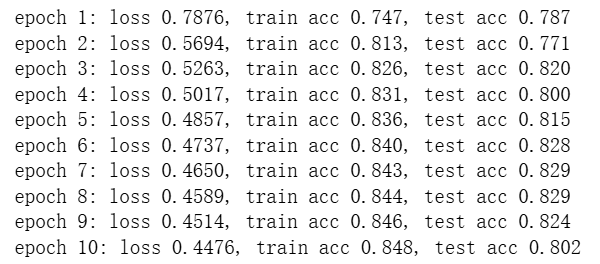

# 3.7. softmax回归的简洁实现

---

## 代码

```python
import torch
from torch import nn
from d2l import torch as d2l

batch_size = 256
train_iter, test_iter = d2l.load_data_fashion_mnist(batch_size)

# 想要查看train_iter的形状不能train_iter.shape
# 因为train_iter 是 PyTorch 的 DataLoader 对象，本质上是个可迭代器（iterator），并不是一个张量（torch.Tensor），所以它没有 .shape 属性

# iter():把一个可迭代对象（比如 train_iter、list、tuple）变成一个迭代器对象，迭代器对象是可以用 next() 一次一次取数据的
# next():从迭代器对象里取下一个元素，每调用一次 next()，迭代器就往前走一步，直到取完所有元素，如果再调用 next()，会报 StopIteration 错误

# 每次取一个batch
X, y = next(iter(train_iter))
print(X.shape)  # 图片批次的形状
print(y.shape)  # 标签批次的形状

# PyTorch不会隐式地调整输入的形状。因此，
# nn.Linear 全连接层要求输入是二维所以要在之前加入展平层，将(batchsize, 1, 28, 28)的输入形状转换为(batchsize,784)
net = nn.Sequential(nn.Flatten(), nn.Linear(784, 10))

def init_weights(m):
    if type(m) == nn.Linear:
        nn.init.normal_(m.weight, std=0.01)

net.apply(init_weights);

loss = nn.CrossEntropyLoss(reduction='none')
trainer = torch.optim.SGD(net.parameters(), lr=0.1)

num_epochs = 10
# d2l包里没有train_ch3方法
# d2l.train_ch3(net, train_iter, test_iter, loss, num_epochs, trainer)

# 累加器
class Accumulator:
    """在n个变量上累加"""
    def __init__(self, n):
        self.data = [0.0] * n
    def add(self, *args):
        self.data = [a + float(b) for a, b in zip(self.data, args)]
    def reset(self):
        self.data = [0.0] * len(self.data)
    def __getitem__(self, idx):
        return self.data[idx]

# 准确率
def accuracy(y_hat, y):
    # y_hat 是 logits 或 概率都可以；二维时按类别维取 argmax
    if y_hat.ndim > 1 and y_hat.shape[1] > 1:
        y_hat = y_hat.argmax(dim=1)
    return (y_hat.type(y.dtype) == y).float().mean().item()

# 在数据集上评估准确率
def evaluate_accuracy(net, data_iter):
    if isinstance(net, torch.nn.Module):
        net.eval()
    metric = Accumulator(2)  # [预测正确数, 总样本数]
    with torch.no_grad():
        for X, y in data_iter:
            metric.add((net(X).argmax(dim=1) == y).sum(), y.numel())
    return metric[0] / metric[1]

# 训练一轮
def train_epoch_ch3(net, train_iter, loss, updater):
    if isinstance(net, torch.nn.Module):
        net.train()
    metric = Accumulator(3)  # [损失和, 预测正确数, 样本总数]
    for X, y in train_iter:
        y_hat = net(X)
        l = loss(y_hat, y)            # 这里兼容 CrossEntropyLoss(reduction='none')
        if isinstance(updater, torch.optim.Optimizer):
            updater.zero_grad()
            l.mean().backward()
            updater.step()
        else:
            l.sum().backward()
            updater(X.shape[0])
        metric.add(l.sum(), (y_hat.argmax(dim=1) == y).sum(), y.numel())
    return metric[0] / metric[2], metric[1] / metric[2]

# 训练主流程（含简单打印）
def train_ch3(net, train_iter, test_iter, loss, num_epochs, updater):
    for epoch in range(num_epochs):
        train_loss, train_acc = train_epoch_ch3(net, train_iter, loss, updater)
        test_acc = evaluate_accuracy(net, test_iter)
        print(f'epoch {epoch+1}: '
              f'loss {train_loss:.4f}, train acc {train_acc:.3f}, test acc {test_acc:.3f}')

train_ch3(net, train_iter, test_iter, loss, num_epochs, trainer)
```

---

## 运行结果


