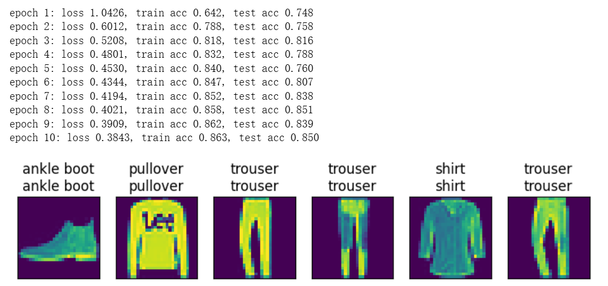

# 动手学深度学习-4.2. 多层感知机的从零开始实现

---

## 代码

```python
import torch
from torch import nn
from d2l import torch as d2l

batch_size = 256
train_iter, test_iter = d2l.load_data_fashion_mnist(batch_size)

num_inputs, num_outputs, num_hiddens = 784, 10, 256

W1 = nn.Parameter(torch.randn(
    num_inputs, num_hiddens, requires_grad=True) * 0.01)
b1 = nn.Parameter(torch.zeros(num_hiddens, requires_grad=True))
W2 = nn.Parameter(torch.randn(
    num_hiddens, num_outputs, requires_grad=True) * 0.01)
b2 = nn.Parameter(torch.zeros(num_outputs, requires_grad=True))

params = [W1, b1, W2, b2]

def relu(X):
    # 创建一个形状，dtype，device与X完全相同的全0张量
    # dtype 决定了张量里单个元素的数值类型和精度
    # device 表示张量存储和计算所在的硬件设备
    a = torch.zeros_like(X)
    return torch.max(X, a)

def net(X):
    X = X.reshape((-1, num_inputs))
    # @代表矩阵乘法
    H = relu(X@W1 + b1)
    return (H@W2 + b2)

# 默认对最后一层进行softmax处理
loss = nn.CrossEntropyLoss(reduction='none')

num_epochs, lr = 10, 0.1
updater = torch.optim.SGD(params, lr=lr)

# 累加器
class Accumulator:
    """在n个变量上累加"""
    def __init__(self, n):
        self.data = [0.0] * n
    def add(self, *args):
        self.data = [a + float(b) for a, b in zip(self.data, args)]
    def reset(self):
        self.data = [0.0] * len(self.data)
    def __getitem__(self, idx):
        return self.data[idx]

# 准确率
def accuracy(y_hat, y):
    # y_hat 是 logits 或 概率都可以；二维时按类别维取 argmax
    if y_hat.ndim > 1 and y_hat.shape[1] > 1:
        y_hat = y_hat.argmax(dim=1)
    return (y_hat.type(y.dtype) == y).float().mean().item()

# 在数据集上评估准确率
def evaluate_accuracy(net, data_iter):
    if isinstance(net, torch.nn.Module):
        net.eval()
    metric = Accumulator(2)  # [预测正确数, 总样本数]
    with torch.no_grad():
        for X, y in data_iter:
            metric.add((net(X).argmax(dim=1) == y).sum(), y.numel())
    return metric[0] / metric[1]

# 训练一轮
def train_epoch_ch3(net, train_iter, loss, updater):
    if isinstance(net, torch.nn.Module):
        net.train()
    metric = Accumulator(3)  # [损失和, 预测正确数, 样本总数]
    for X, y in train_iter:
        y_hat = net(X)
        l = loss(y_hat, y)            # 这里兼容 CrossEntropyLoss(reduction='none')
        if isinstance(updater, torch.optim.Optimizer):
            updater.zero_grad()
            l.mean().backward()
            updater.step()
        else:
            l.sum().backward()
            updater(X.shape[0])
        metric.add(l.sum(), (y_hat.argmax(dim=1) == y).sum(), y.numel())
    return metric[0] / metric[2], metric[1] / metric[2]

# 训练主流程（含简单打印）
def train_ch3(net, train_iter, test_iter, loss, num_epochs, updater):
    for epoch in range(num_epochs):
        train_loss, train_acc = train_epoch_ch3(net, train_iter, loss, updater)
        test_acc = evaluate_accuracy(net, test_iter)
        print(f'epoch {epoch+1}: '
              f'loss {train_loss:.4f}, train acc {train_acc:.3f}, test acc {test_acc:.3f}')

train_ch3(net, train_iter, test_iter, loss, num_epochs, updater)

def predict_ch3(net, test_iter, n=6):  #@save
    """随机选n张图片，展示真实和预测标签"""
    for X, y in test_iter:
        break    # 取第一个batch
    trues = d2l.get_fashion_mnist_labels(y)                 # 真实标签（转文本）
    preds = d2l.get_fashion_mnist_labels(net(X).argmax(axis=1))  # 预测标签（转文本）
    # 合并“真实+预测”作为标题
    titles = [true +'\n' + pred for true, pred in zip(trues, preds)]
    # 可视化前n张图片及标签
    d2l.show_images(
        X[0:n].reshape((n, 28, 28)), 1, n, titles=titles[0:n])
predict_ch3(net, test_iter)
```

---

## 运行结果


