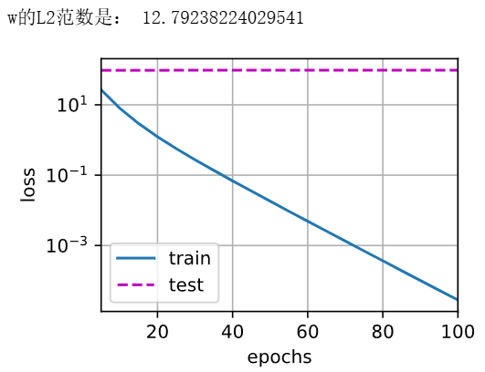
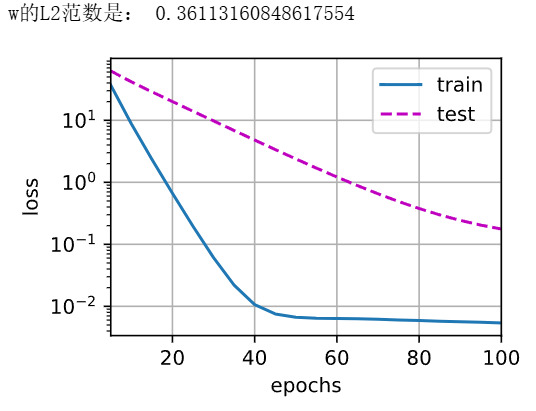
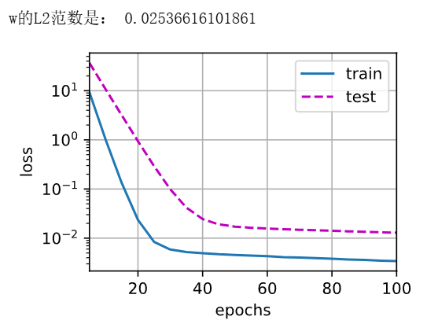
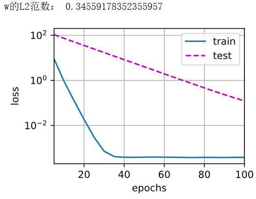
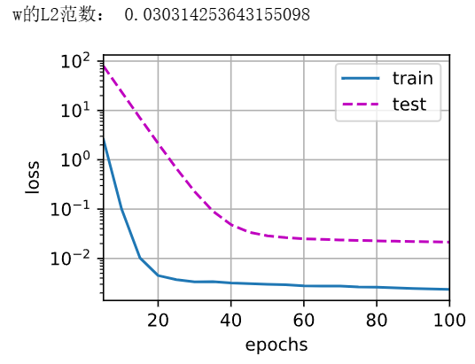
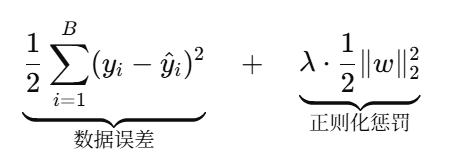

# 动手学深度学习-4.5. 权重衰减

---

## 代码

```python
%matplotlib inline
import torch
from torch import nn
from d2l import torch as d2l

n_train, n_test, num_inputs, batch_size = 20, 100, 200, 5
true_w, true_b = torch.ones((num_inputs, 1)) * 0.01, 0.05
# d2l.synthetic_data会生成生成满足𝑦=𝑋𝑤+𝑏+𝜖的数据，返回 (features, labels) 两个张量
train_data = d2l.synthetic_data(true_w, true_b, n_train)
# d2l.load_array((features, labels), batch_size, is_train)用 TensorDataset + DataLoader 打包成小批量数据迭代器。
# 得到的train_iter 每次迭代给一批 (X, y)，形状分别是 (batch_size, 200) 和 (batch_size, 1)
train_iter = d2l.load_array(train_data, batch_size)

test_data = d2l.synthetic_data(true_w, true_b, n_test)
test_iter = d2l.load_array(test_data, batch_size, is_train=False)
```

```python
def init_params():
    w = torch.normal(0, 1, size=(num_inputs, 1), requires_grad=True)
    b = torch.zeros(1, requires_grad=True)
    return [w, b]
def l2_penalty(w):
    return torch.sum(w.pow(2)) / 2
```

```python
def train(lambd):
    w, b = init_params()
    # 此处的loss是不带L2惩罚项的损失函数
    net, loss = lambda X: d2l.linreg(X, w, b), d2l.squared_loss
    num_epochs, lr = 100, 0.003
    animator = d2l.Animator(xlabel='epochs', ylabel='loss', yscale='log',
                            xlim=[5, num_epochs], legend=['train', 'test'])
    for epoch in range(num_epochs):
        for X, y in train_iter:
            # 增加了L2范数惩罚项，
            # 广播机制使l2_penalty(w)成为一个长度为batch_size的向量
            l = loss(net(X), y) + lambd * l2_penalty(w)
            l.sum().backward()
            d2l.sgd([w, b], lr, batch_size)
        if (epoch + 1) % 5 == 0:
            animator.add(epoch + 1, (d2l.evaluate_loss(net, train_iter, loss),
                                     d2l.evaluate_loss(net, test_iter, loss)))
    print('w的L2范数是：', torch.norm(w).item())
```

```python
# 不用正则化
train(lambd=0)
```



```python
# 适中正则化
train(lambd=3)
```



```python
# 强正则化
train(lambd=10)
```



```python
# 使用框架自带的方法实现L2正则化
def train_concise(wd):
    net = nn.Sequential(nn.Linear(num_inputs, 1))
    for param in net.parameters():
        param.data.normal_()
    loss = nn.MSELoss(reduction='none')
    num_epochs, lr = 100, 0.003
    # net[0].weight → 设置 weight_decay=wd，表示在更新时自动加上 L2 正则项梯度
    # 偏置参数没有衰减
    trainer = torch.optim.SGD([
        {"params":net[0].weight,'weight_decay': wd},
        {"params":net[0].bias}], lr=lr)
    animator = d2l.Animator(xlabel='epochs', ylabel='loss', yscale='log',
                            xlim=[5, num_epochs], legend=['train', 'test'])
    for epoch in range(num_epochs):
        for X, y in train_iter:
            trainer.zero_grad() # 清除上一步的梯度
            # loss(...) 计算逐样本的 MSE 损失（不含正则项，L2 正则化由优化器在梯度更新时自动添加）
            l = loss(net(X), y) # net(X)前向计算预测值
            # .mean()：转成标量（批内平均），这样 backward() 才能运行 
            # .backward()：反向传播，计算纯数据误差的梯度；
            # 之后在 trainer.step() 阶段，优化器会在梯度中额外加上 wd * w（实现 L2 正则化的效果）
            l.mean().backward()           
            trainer.step() # 按 SGD 规则更新参数
        if (epoch + 1) % 5 == 0:
            animator.add(epoch + 1,
                         (d2l.evaluate_loss(net, train_iter, loss),
                          d2l.evaluate_loss(net, test_iter, loss)))
    print('w的L2范数：', net[0].weight.norm().item())
```

```python
train_concise(0)
```


```python
train_concise(3)
```



```python
train_concise(10)
```



---

## 问题总结

### 问1：w.pow(2)具体是怎么计算的，w不是一个矩阵吗

`w` 在这里是一个形状 `(200, 1)` 的**二维张量**（可以看作 200×1 矩阵），`w.pow(2)` 是 **逐元素平方** 运算，不是矩阵乘法平方。

即对 `w` 中的每一个元素 w_i_j 单独平方，得到的新张量的形状和 `w` 完全一样。

### 问2：train()函数中lambd这个参数有什么意义

`lambd` 就是 **L2 正则化的系数**（也叫权重衰减系数、regularization coefficient），它直接控制了**正则项在总损失中所占的比重**。

train()函数中定义的损失函数形式为：


$$
λ 越大 → 正则化惩罚项越重要 → 模型会更强烈地压缩权重的大小 → 权重的 L2 范数∥𝑤∥_2会变小\\
λ 越小 → 正则化的作用越弱 → 更接近普通的最小二乘回归。
$$


### 问3： **`w` 的 L2 范数**在这里到底意味着什么

 `w` 是一个 **(200×1) 的列向量**，代表 200 个输入特征的权重系数。

L2 范数（Euclidean norm）就是把它看作一个**点**，测量它离原点有多远：
$$
∥w∥_2 = \sqrt{w_1^2 +w_2^2 +⋯+w_{200}^2}
$$
这就像测量一个 200 维空间里的向量的“**长度**”（它是**权重向量的长度**，在数学上就是到原点的距离）。

**值越大** → 权重整体幅度越大，说明模型更“激进”，对输入变化反应可能更敏感，过拟合风险更高。

**值越小** → 权重整体幅度越小，模型更平滑，对新数据可能泛化更好（但也可能欠拟合）。

### 

### 
