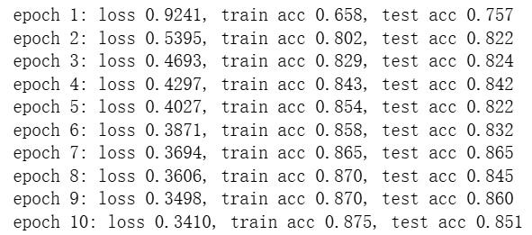
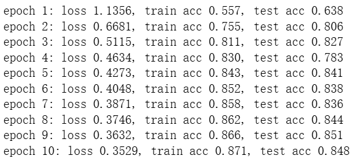

# 动手学深度学习-4.6. 暂退法（Dropout）

---

## 代码-从零开始版本

```python
import torch
from torch import nn
from d2l import torch as d2l


def dropout_layer(X, dropout):
    assert 0 <= dropout <= 1
    # 在本情况中，所有元素都被丢弃
    if dropout == 1:
        return torch.zeros_like(X)
    # 在本情况中，所有元素都被保留
    if dropout == 0:
        return X
    # dropout表示丢弃概率，比如若dropout=0.8，随机数小于0.8的都会变成false，即被丢弃
    mask = (torch.rand(X.shape) > dropout).float()
    return mask * X / (1.0 - dropout)

X= torch.arange(16, dtype = torch.float32).reshape((2, 8))
print(X)
print(dropout_layer(X, 0.))
print(dropout_layer(X, 0.5))
print(dropout_layer(X, 1.))
# 运行结果为：
# tensor([[ 0.,  1.,  2.,  3.,  4.,  5.,  6.,  7.],
#         [ 8.,  9., 10., 11., 12., 13., 14., 15.]])
# tensor([[ 0.,  1.,  2.,  3.,  4.,  5.,  6.,  7.],
#         [ 8.,  9., 10., 11., 12., 13., 14., 15.]])
# tensor([[ 0.,  2.,  0.,  6.,  0.,  0.,  0.,  0.],
#         [ 0.,  0.,  0., 22.,  0., 26.,  0., 30.]])
# tensor([[0., 0., 0., 0., 0., 0., 0., 0.],
#         [0., 0., 0., 0., 0., 0., 0., 0.]])

num_inputs, num_outputs, num_hiddens1, num_hiddens2 = 784, 10, 256, 256

dropout1, dropout2 = 0.2, 0.5

class Net(nn.Module):
    def __init__(self, num_inputs, num_outputs, num_hiddens1, num_hiddens2,
                 is_training = True):
        # 继承超类的初始化方法
        super(Net, self).__init__()
        self.num_inputs = num_inputs
        self.training = is_training
        self.lin1 = nn.Linear(num_inputs, num_hiddens1)
        self.lin2 = nn.Linear(num_hiddens1, num_hiddens2)
        self.lin3 = nn.Linear(num_hiddens2, num_outputs)
        self.relu = nn.ReLU()

    def forward(self, X):
        H1 = self.relu(self.lin1(X.reshape((-1, self.num_inputs))))
        # 只有在训练模型时才使用dropout
        if self.training == True:
            # 在第一个全连接层之后添加一个dropout层
            H1 = dropout_layer(H1, dropout1)
        H2 = self.relu(self.lin2(H1))
        if self.training == True:
            # 在第二个全连接层之后添加一个dropout层
            H2 = dropout_layer(H2, dropout2)
        out = self.lin3(H2)
        return out

net = Net(num_inputs, num_outputs, num_hiddens1, num_hiddens2)

num_epochs, lr, batch_size = 10, 0.5, 256
loss = nn.CrossEntropyLoss(reduction='none')
train_iter, test_iter = d2l.load_data_fashion_mnist(batch_size)
trainer = torch.optim.SGD(net.parameters(), lr=lr)

# 累加器
class Accumulator:
    """在n个变量上累加"""
    def __init__(self, n):
        self.data = [0.0] * n
    def add(self, *args):
        self.data = [a + float(b) for a, b in zip(self.data, args)]
    def reset(self):
        self.data = [0.0] * len(self.data)
    def __getitem__(self, idx):
        return self.data[idx]
# 准确率
def accuracy(y_hat, y):
    # y_hat 是 logits 或 概率都可以；二维时按类别维取 argmax
    if y_hat.ndim > 1 and y_hat.shape[1] > 1:
        y_hat = y_hat.argmax(dim=1)
    return (y_hat.type(y.dtype) == y).float().mean().item()

# 在数据集上评估准确率
def evaluate_accuracy(net, data_iter):
    if isinstance(net, torch.nn.Module):
        net.eval()
    metric = Accumulator(2)  # [预测正确数, 总样本数]
    with torch.no_grad():
        for X, y in data_iter:
            metric.add((net(X).argmax(dim=1) == y).sum(), y.numel())
    return metric[0] / metric[1]

# 训练一轮
def train_epoch_ch3(net, train_iter, loss, updater):
    if isinstance(net, torch.nn.Module):
        net.train()
    metric = Accumulator(3)  # [损失和, 预测正确数, 样本总数]
    for X, y in train_iter:
        y_hat = net(X)
        l = loss(y_hat, y)            # 这里兼容 CrossEntropyLoss(reduction='none')
        if isinstance(updater, torch.optim.Optimizer):
            updater.zero_grad()
            l.mean().backward()
            updater.step()
        else:
            l.sum().backward()
            updater(X.shape[0])
        metric.add(l.sum(), (y_hat.argmax(dim=1) == y).sum(), y.numel())
    return metric[0] / metric[2], metric[1] / metric[2]

# 训练主流程（含简单打印）
def train_ch3(net, train_iter, test_iter, loss, num_epochs, updater):
    for epoch in range(num_epochs):
        train_loss, train_acc = train_epoch_ch3(net, train_iter, loss, updater)
        test_acc = evaluate_accuracy(net, test_iter)
        print(f'epoch {epoch+1}: '
              f'loss {train_loss:.4f}, train acc {train_acc:.3f}, test acc {test_acc:.3f}')
train_ch3(net, train_iter, test_iter, loss, num_epochs, trainer)

num_epochs, lr, batch_size = 10, 0.5, 256
loss = nn.CrossEntropyLoss(reduction='none')
train_iter, test_iter = d2l.load_data_fashion_mnist(batch_size)
trainer = torch.optim.SGD(net.parameters(), lr=lr)

# 累加器
class Accumulator:
    """在n个变量上累加"""
    def __init__(self, n):
        self.data = [0.0] * n
    def add(self, *args):
        self.data = [a + float(b) for a, b in zip(self.data, args)]
    def reset(self):
        self.data = [0.0] * len(self.data)
    def __getitem__(self, idx):
        return self.data[idx]
# 准确率
def accuracy(y_hat, y):
    # y_hat 是 logits 或 概率都可以；二维时按类别维取 argmax
    if y_hat.ndim > 1 and y_hat.shape[1] > 1:
        y_hat = y_hat.argmax(dim=1)
    return (y_hat.type(y.dtype) == y).float().mean().item()

# 在数据集上评估准确率
def evaluate_accuracy(net, data_iter):
    if isinstance(net, torch.nn.Module):
        net.eval()
    metric = Accumulator(2)  # [预测正确数, 总样本数]
    with torch.no_grad():
        for X, y in data_iter:
            metric.add((net(X).argmax(dim=1) == y).sum(), y.numel())
    return metric[0] / metric[1]

# 训练一轮
def train_epoch_ch3(net, train_iter, loss, updater):
    if isinstance(net, torch.nn.Module):
        net.train()
    metric = Accumulator(3)  # [损失和, 预测正确数, 样本总数]
    for X, y in train_iter:
        y_hat = net(X)
        l = loss(y_hat, y)            # 这里兼容 CrossEntropyLoss(reduction='none')
        if isinstance(updater, torch.optim.Optimizer):
            updater.zero_grad()
            l.mean().backward()
            updater.step()
        else:
            l.sum().backward()
            updater(X.shape[0])
        metric.add(l.sum(), (y_hat.argmax(dim=1) == y).sum(), y.numel())
    return metric[0] / metric[2], metric[1] / metric[2]

# 训练主流程（含简单打印）
def train_ch3(net, train_iter, test_iter, loss, num_epochs, updater):
    for epoch in range(num_epochs):
        train_loss, train_acc = train_epoch_ch3(net, train_iter, loss, updater)
        test_acc = evaluate_accuracy(net, test_iter)
        print(f'epoch {epoch+1}: '
              f'loss {train_loss:.4f}, train acc {train_acc:.3f}, test acc {test_acc:.3f}')
train_ch3(net, train_iter, test_iter, loss, num_epochs, trainer)
```



## 代码-简洁版本

```python
import torch
from torch import nn
from d2l import torch as d2l

dropout1, dropout2 = 0.2, 0.5
net = nn.Sequential(nn.Flatten(),
        nn.Linear(784, 256),
        nn.ReLU(),
        # 在第一个全连接层之后添加一个dropout层
        nn.Dropout(dropout1),
        nn.Linear(256, 256),
        nn.ReLU(),
        # 在第二个全连接层之后添加一个dropout层
        nn.Dropout(dropout2),
        nn.Linear(256, 10))

def init_weights(m):
    if type(m) == nn.Linear:
        nn.init.normal_(m.weight, std=0.01)

net.apply(init_weights);
lr = 0.5
batch_size = 256
num_epochs=10
loss = nn.CrossEntropyLoss(reduction='none')
train_iter, test_iter = d2l.load_data_fashion_mnist(batch_size)
trainer = torch.optim.SGD(net.parameters(), lr=lr)
# 累加器
class Accumulator:
    """在n个变量上累加"""
    def __init__(self, n):
        self.data = [0.0] * n
    def add(self, *args):
        self.data = [a + float(b) for a, b in zip(self.data, args)]
    def reset(self):
        self.data = [0.0] * len(self.data)
    def __getitem__(self, idx):
        return self.data[idx]
# 准确率
def accuracy(y_hat, y):
    # y_hat 是 logits 或 概率都可以；二维时按类别维取 argmax
    if y_hat.ndim > 1 and y_hat.shape[1] > 1:
        y_hat = y_hat.argmax(dim=1)
    return (y_hat.type(y.dtype) == y).float().mean().item()

# 在数据集上评估准确率
def evaluate_accuracy(net, data_iter):
    if isinstance(net, torch.nn.Module):
        net.eval()
    metric = Accumulator(2)  # [预测正确数, 总样本数]
    with torch.no_grad():
        for X, y in data_iter:
            metric.add((net(X).argmax(dim=1) == y).sum(), y.numel())
    return metric[0] / metric[1]

# 训练一轮
def train_epoch_ch3(net, train_iter, loss, updater):
    if isinstance(net, torch.nn.Module):
        net.train()
    metric = Accumulator(3)  # [损失和, 预测正确数, 样本总数]
    for X, y in train_iter:
        y_hat = net(X)
        l = loss(y_hat, y)            # 这里兼容 CrossEntropyLoss(reduction='none')
        if isinstance(updater, torch.optim.Optimizer):
            updater.zero_grad()
            l.mean().backward()
            updater.step()
        else:
            l.sum().backward()
            updater(X.shape[0])
        metric.add(l.sum(), (y_hat.argmax(dim=1) == y).sum(), y.numel())
    return metric[0] / metric[2], metric[1] / metric[2]

# 训练主流程（含简单打印）
def train_ch3(net, train_iter, test_iter, loss, num_epochs, updater):
    for epoch in range(num_epochs):
        train_loss, train_acc = train_epoch_ch3(net, train_iter, loss, updater)
        test_acc = evaluate_accuracy(net, test_iter)
        print(f'epoch {epoch+1}: '
              f'loss {train_loss:.4f}, train acc {train_acc:.3f}, test acc {test_acc:.3f}')

train_ch3(net, train_iter, test_iter, loss, num_epochs, trainer)
```



---

## 问题总结

### 问1：dropout_layer(X, dropout)函数中为什么要除以1-p？

dropout_layer(X, dropout)流程：

（1）检查参数范围

```python
assert 0 <= dropout <= 1
```

（2）处理极端情况

```python
if dropout == 1:
    return torch.zeros_like(X)  # 全丢弃
if dropout == 0:
    return X                    # 全保留
```

（3）生成随机掩码（mask）

```python
mask = (torch.rand(X.shape) > dropout).float()
```

- torch.rand(X.shape)生成与X形状相同的数值随机在(0,1)的向量，比如
- 与dropout比较得到布尔矩阵（`True` 表示保留，`False` 表示丢弃）
- .float()把布尔值转成 1.0 / 0.0，便于数值运算

最终得到的mask形式为

```python
tensor([[1., 0., 1., ...],
        [0., 1., 1., ...]])
```

（4）返回缩放后的向量

```python
return mask * X / (1.0 - dropout)
```

#### 为什么要除以1-p？

（1）从直觉上理解：

Dropout 训练时会随机丢一部分神经元（设丢弃概率 p，保留概率 q=1−p）。

- 如果直接丢掉一部分不做补偿，训练时神经元的**平均激活值会变小**；
- 然而推理时不开 Dropout（所有神经元都参与），平均值会变大 → 分布不一致 → 影响模型稳定性。

**所以要在训练时放大保留的神经元输出，让整体平均值和推理时一致。**

（2）从数学期望来看

假设某个神经元在 Dropout 前的输出是 x，掩码变量 M 服从二项伯努利分布（M 之所以服从 **伯努利分布**，是因为 Dropout 的核心就是**对每个神经元（或特征）独立地做一次二选一的随机试验**）：
$$
M∼Bernoulli(q)
\\其中：𝑃(𝑀=1)=𝑞=1−𝑝（保留概率）\\𝑃(𝑀=0)=𝑝（丢弃概率）
$$
若没有除以1-p：
$$
训练时输出：𝑦=𝑀⋅𝑥\\
期望：𝐸[𝑦]=𝐸[𝑀]⋅𝑥=𝑞⋅𝑥\\
推理时（不开 Dropout）输出是 𝑥\\
期望不一致：𝐸_{train}[𝑦]=𝑞·𝑥≠𝑥=𝐸_{test}[𝑦]
$$
若除以了1-p：
$$
训练时输出：𝑦=𝑀⋅𝑥/q\\
期望：𝐸[𝑦]=𝐸[𝑀]⋅𝑥/q=𝑥\\
期望一致：𝐸_{train}[𝑦]=𝐸_{test}[𝑦]
$$
