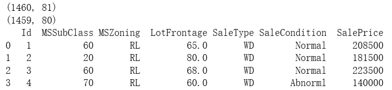
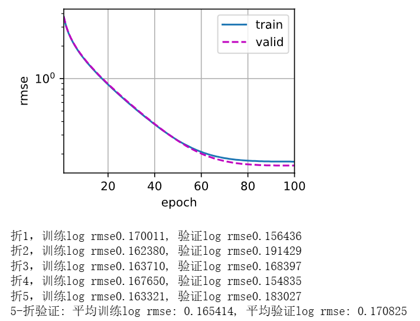
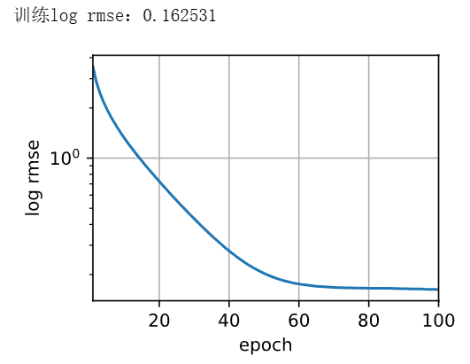

# 动手学深度学习-4.10. 实战Kaggle比赛：预测房价

---

## 代码

```python
# ===== (1) 下载工具（只保留用到的 download） =====
import hashlib
import os
import requests

#@save
DATA_HUB = dict()  # 记录数据别名 -> (下载URL, 文件SHA1校验值)
DATA_URL = 'http://d2l-data.s3-accelerate.amazonaws.com/'

def download(name, cache_dir=os.path.join('..', 'data')):  #@save
    """从 DATA_HUB 下载 name 对应文件，若本地已有且校验通过则直接复用，返回本地文件路径"""
    assert name in DATA_HUB, f"{name} 不存在于 DATA_HUB"
    url, sha1_hash = DATA_HUB[name]
    os.makedirs(cache_dir, exist_ok=True)
    fname = os.path.join(cache_dir, url.split('/')[-1])  # 本地缓存文件路径：../data/文件名.csv

    # 命中缓存：存在同名文件则做一次SHA1校验，匹配则直接返回，避免重复下载
    if os.path.exists(fname):
        sha1 = hashlib.sha1()
        with open(fname, 'rb') as f:
            # 分块读取计算哈希，避免一次性读入内存
            while True:
                data = f.read(1048576)  # 1MB
                if not data:
                    break
                sha1.update(data)
        if sha1.hexdigest() == sha1_hash:
            return fname

    # 未命中缓存则下载
    print(f'正在从{url}下载到 {fname} ...')
    r = requests.get(url, stream=True, verify=True)
    with open(fname, 'wb') as f:
        f.write(r.content)
    return fname
```

```python
# ===== (2) 读取数据 =====
%matplotlib inline
import numpy as np
import pandas as pd
import torch
from torch import nn
from d2l import torch as d2l
import matplotlib.pyplot as plt 

# 在 DATA_HUB 中登记训练集和测试集的下载信息（URL + SHA1）
DATA_HUB['kaggle_house_train'] = (  #@save
    DATA_URL + 'kaggle_house_pred_train.csv',
    '585e9cc93e70b39160e7921475f9bcd7d31219ce'
)
DATA_HUB['kaggle_house_test'] = (  #@save
    DATA_URL + 'kaggle_house_pred_test.csv',
    'fa19780a7b011d9b009e8bff8e99922a8ee2eb90'
)

# 下载并读取 CSV 到 DataFrame
train_data = pd.read_csv(download('kaggle_house_train'))
test_data  = pd.read_csv(download('kaggle_house_test'))

# 打印形状做 sanity check
print(train_data.shape)
print(test_data.shape)
# 预览若干列（含 Id / 少量特征 / 末尾几列），快速感知数据
print(train_data.iloc[0:4, [0, 1, 2, 3, -3, -2, -1]])
```



```python
# ===== (3) 预处理：拼接 -> 标准化数值列 -> one-hot 类别列 =====
# 将训练和测试的“特征”拼接在一起统一预处理：
#  - 训练集丢弃 Id 与 SalePrice（最后一列）
#  - 测试集丢弃 Id
# 这样做可以确保后续 one-hot 得到的列集合一致（避免列不对齐）
all_features = pd.concat(
    (train_data.iloc[:, 1:-1],  # 训练：去掉 Id 和 SalePrice
     test_data.iloc[:, 1:])     # 测试：去掉 Id
)

# 找到数值列（非 object 类型）；object 一般是类别/字符串列
numeric_features = all_features.dtypes[all_features.dtypes != 'object'].index

# 对数值列做 z-score 标准化：每列减均值、除标准差（提升收敛、避免量纲差异）
all_features[numeric_features] = all_features[numeric_features].apply(
    lambda x: (x - x.mean()) / (x.std())
)
# 标准化后若有 NaN（如全空列），统一填 0（等价于均值）
all_features[numeric_features] = all_features[numeric_features].fillna(0)

# 对类别列做独热编码（含缺失 dummy_na=True），并强制 dtype=float（0.0/1.0）
# 目的：彻底消除 object 列，保证后面转成 torch.tensor 不会因 dtype=object 报错
all_features = pd.get_dummies(all_features, dummy_na=True, dtype=float)

# 将拼接后的特征重新切回训练/测试两块，并转为 float32 的张量
n_train = train_data.shape[0]
train_features = torch.tensor(all_features[:n_train].values, dtype=torch.float32)
test_features  = torch.tensor(all_features[n_train:].values, dtype=torch.float32)

# 取标签（房价），并 reshape 为 (N, 1) 以匹配模型输出维度
train_labels = torch.tensor(train_data.SalePrice.values.reshape(-1, 1), dtype=torch.float32)
```

```python
# ===== (4) 模型、损失、指标 =====
# 使用线性回归：y = w^T x + b
loss = nn.MSELoss()  # 训练损失：均方误差（在“原价空间”计算）
in_features = train_features.shape[1]  # 输入特征维度（数值列+one-hot 列的总数）

def get_net():
    # 一个线性层即可；输出维度=1（预测房价）
    return nn.Sequential(nn.Linear(in_features, 1))

def log_rmse(net, features, labels):
    """评估指标：对数空间 RMSE（sqrt(MSE(log(pred), log(label))))）
       注意：为了防止 log(<=0)，对预测做了下限截断到 1
    """
    clipped_preds = torch.clamp(net(features), 1, float('inf'))  # 预测值小于1的抬到1
    rmse = torch.sqrt(loss(torch.log(clipped_preds), torch.log(labels)))
    return rmse.item()
```

```python
# ===== (5) 训练循环 =====
def train(net, train_features, train_labels, test_features, test_labels,
          num_epochs, learning_rate, weight_decay, batch_size):
    """标准训练流程：按 batch 训练，记录每个 epoch 的 train/valid 指标"""
    train_ls, test_ls = [], []
    # 用 d2l 的便捷函数把 (X,y) 打包成小批量迭代器
    train_iter = d2l.load_array((train_features, train_labels), batch_size)
    # Adam 优化器（带 weight decay 相当于 L2 正则）
    optimizer = torch.optim.Adam(net.parameters(), lr=learning_rate, weight_decay=weight_decay)
    for epoch in range(num_epochs):
        for X, y in train_iter:
            optimizer.zero_grad()       # 1) 清梯度
            l = loss(net(X), y)         # 2) 前向 + 计算损失（原价空间的 MSE）
            l.backward()                # 3) 反向传播
            optimizer.step()            # 4) 参数更新
        # 每个 epoch 结束后，计算一次整训练集的 log RMSE
        train_ls.append(log_rmse(net, train_features, train_labels))
        # 若提供了验证集（或叫“测试集标签”），计算验证 log RMSE
        if test_labels is not None:
            test_ls.append(log_rmse(net, test_features, test_labels))
    return train_ls, test_ls
```

```python
# ===== (6) K 折交叉验证 =====
def get_k_fold_data(k, i, X, y):
    """将数据按顺序均分为 k 份，返回：第 i 份为验证集，其余 k-1 份拼为训练集"""
    assert k > 1
    fold_size = X.shape[0] // k  # 每折大小（若不能整除，末尾会丢 N%k 个样本）
    X_train, y_train = None, None
    for j in range(k):
        idx = slice(j * fold_size, (j + 1) * fold_size)  # 第 j 折的行区间 [start, stop)
        X_part, y_part = X[idx, :], y[idx]
        if j == i:
            # 第 i 折：作为验证集
            X_valid, y_valid = X_part, y_part
        elif X_train is None:
            # 第一块训练集直接初始化
            X_train, y_train = X_part, y_part
        else:
            # 后续训练块在行维拼接
            X_train = torch.cat([X_train, X_part], 0)
            y_train = torch.cat([y_train, y_part], 0)
    return X_train, y_train, X_valid, y_valid

def k_fold(k, X_train, y_train, num_epochs, learning_rate, weight_decay, batch_size):
    """跑 K 次：每次取一折做验证，其余做训练；汇总每折的最终 train/valid log RMSE 的平均值"""
    train_l_sum, valid_l_sum = 0, 0
    for i in range(k):
        data = get_k_fold_data(k, i, X_train, y_train)  # 切分第 i 折
        net = get_net()  # 每折用一个全新模型，保证独立性
        train_ls, valid_ls = train(net, *data, num_epochs, learning_rate, weight_decay, batch_size)
        # 取本折“最后一个 epoch”的分数累加（简化做法；更稳做法是早停/取最优）
        train_l_sum += train_ls[-1]
        valid_l_sum += valid_ls[-1]
        # 只画第一折的收敛曲线（训练 vs 验证），避免重复
        if i == 0:
            d2l.plot(list(range(1, num_epochs + 1)), [train_ls, valid_ls],
                     xlabel='epoch', ylabel='rmse', xlim=[1, num_epochs],
                     legend=['train', 'valid'], yscale='log')
            plt.show()
        print(f'折{i + 1}，训练log rmse{float(train_ls[-1]):f}, 验证log rmse{float(valid_ls[-1]):f}')
    # 返回 K 折平均
    return train_l_sum / k, valid_l_sum / k
```

```python
# ===== 7) 训练 + 交叉验证 =====
# 说明：下面这组超参是原书的演示值（lr=5 偏大，适合演示；想稳一点可改小）
k, num_epochs, lr, weight_decay, batch_size = 5, 100, 5, 0, 64
train_l, valid_l = k_fold(k, train_features, train_labels, num_epochs, lr, weight_decay, batch_size)
print(f'{k}-折验证: 平均训练log rmse: {float(train_l):f}, 平均验证log rmse: {float(valid_l):f}')
```



```python
# ===== 8) 用全量训练集再训练并导出提交文件 =====
def train_and_pred(train_features, test_features, train_labels, test_data,
                   num_epochs, lr, weight_decay, batch_size):
    """使用全部训练集再次训练一遍模型（不留验证集），对测试集预测并导出 submission.csv"""
    net = get_net()
    train_ls, _ = train(net, train_features, train_labels, None, None,
                        num_epochs, lr, weight_decay, batch_size)
    # 画训练误差曲线（log RMSE）
    d2l.plot(np.arange(1, num_epochs + 1), [train_ls], xlabel='epoch',
             ylabel='log rmse', xlim=[1, num_epochs], yscale='log')
    print(f'训练log rmse：{float(train_ls[-1]):f}')

    # 在测试集上做预测（此处输出是“原价空间”的预测）
    preds = net(test_features).detach().numpy()
    # Kaggle 提交需要两列：Id 和 SalePrice
    test_data['SalePrice'] = pd.Series(preds.reshape(1, -1)[0])  # 拉平成一维
    submission = pd.concat([test_data['Id'], test_data['SalePrice']], axis=1)
    submission.to_csv('submission.csv', index=False)  # 保存提交文件

# 最终训练并导出提交文件（可直接上传 Kaggle）
train_and_pred(train_features, test_features, train_labels, test_data,
               num_epochs, lr, weight_decay, batch_size)
```



